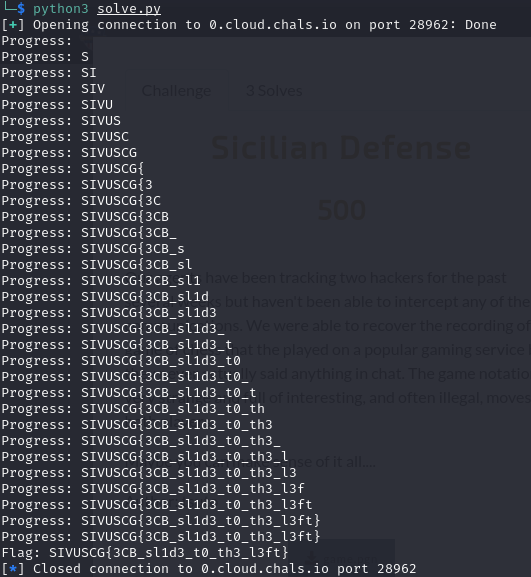

# Crypto: Encryptomatic (132)

Our new Encryptomatic tool makes securing your messages a snap!

*nc 0.cloud.chals.io 28962*

Author: [tsuto](https://github.com/jselliott)

**Files:** [main.py](Files/main.py)

## Writeup

Since we're given the code for this TCP server, the best way to start is analyzing the code!

Here, we can see we have a program where the user provides input, the flag is concatenated to the input, and this is encrypted and sent back to the user.

Specifically, the encryption uses AES-ECB with a 16-byte key. Something interesting about this is that the plaintext is encrypted in blocks of 16 bytes. So the first 16 bytes will be encrypted separately from the next 16 and the 16 after that and so on.

Now, what if we can control how much of the flag is in a given block?

Looking at the first block as what we're looking at, if we add a known pattern of length 15 (such as "a" repeated 15 times), only the first character of the flag will be in this block, which makes it easy to guess by encrypting this pattern followed by our guess characters with the pattern followed by the flag until they are equal. When they are equal, it means our guess character is the same as the first character of the flag.

Additionally, if we change this pattern to length of 14 and know that first character of the flag, we can get the second, and follow similarly to get the third and so on.

However, if the flag is longer than 1 block (which it is), this can be tricky. In that case, we can still pad through the second block and compare the first two blocks of our guess and the actual flag. So, for starting the second block, we can once again use a pattern of length 15 followed by our guess for the first half (length 16) and then our guess character, and then compare the first 32 bytes (or 64 characters in hex) of our guess and the actual flag.

And going through this repeatedly, we can get the flag! Though, we'll need to automate this to make it easier and faster to get the flag.

Using Python, we first need to connect to the challenge. Also, we will need to import pwntools for handling the connection and the list of printable characters from string.

```py
from pwn import *
from string import printable
r = remote("0.cloud.chals.io", 28962)
```

Now, we can write a function to test a guess at the flag.

```py
# Function to test a plaintext attack
# Takes in connection, crib (known plaintext), block length, and total length
def test_crib(r, crib, l, end = 32):
	# Pad input with "a" character and add our guess
	plaintext = "a" * (l - len(crib)) + crib
	# Write our control plaintext to the TCP connection
	r.write(plaintext.encode() + b'\n')
	# Get first characters of returned ciphertext as control
	control = r.recv().decode().split(': ')[1].split("\n")[0][0:end]
	
	# Now, another input without our guess
	# Instead of our guess, the end of the block will be letters from the flag, which we can compare
	plaintext = "a" * (l - len(crib))
	# Write our test plaintext to the TCP connection
	r.write(plaintext.encode() + b'\n')
	# Get first characters of ciphertext as test case
	test_dat = r.recv().decode().split(': ')[1].split("\n")[0][0:end]
	
	# If our control is equal to our test case, we have a good guess!
	return control == test_dat
```

And then we just need to implement it with our environment!

```py
# Initialize our guess
crib = ""
# Variable to store the number of characters
enc_chars = 0
# Assuming the flag is less than 32 characters, we'll only need 2 blocks of 16 characters
for j in range(2):
	# Add the number of characters in the ciphertext block size (32 chars for 16 bytes of hex)
	enc_chars += 32
	# Loop through our block size
	for i in range(block_length):
		# Print progress for debugging
		print("Progress:", crib)
		# Loop through possible printable characters for the next character
		for curr_char in printable:
			# Store our temporary testing plaintext guess for the flag (current progress + new test character)
			curr_crib = crib + curr_char
			# Test our guess, and if it's right, we have more progress!
			# The block length needs to be multiplied by the number of blocks to account for the second block
			if test_crib(r, curr_crib, block_length * (enc_chars // 32), enc_chars):
				crib = curr_crib
				break

# Print our flag:
print("Flag:", crib)
```

And running this, we can get our flag!



And we get our flag to be `SIVUSCG{3CB_sl1d3_t0_th3_l3ft}`
