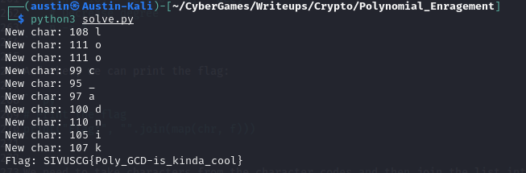

# Crypto: Polynomial Enragement (489)

Since when did polynomials become so confusing... Glad it's not over a field ;)

Author: SuperBeetleGamer

## Writeup

The first step here is to look at our code and our output.

Looking in our output, a text file, we can see that our ciphertext isn't like most: it's a polynomial.

And looking at our code, a file for SageMath, based on Python, we can see that this is because we have a flag converted to a polynomial, by the character codes being the coefficients, multiplied by two random polynomials of degree 10 with a 5-degree noise polynomial added to the result of each.

Luckily, it is pretty easy to solve this by looking at the terms of each degree.

Let's start with the highest degree: 40.

Between a 30-degree flag polynomial and a 10-degree random polynomial, the only product equalling a degree of 40 is the 10th degree of the random polynomial and the 30th degree of the flag polynomial. So, it is likely that the character code of the flag is the GCF of our coefficients in the output polynomials, 125 and 1750. And this GCF is 125, which corresponds to the "}" character, the last character of the flag.

With this, since `1 * 125 = 125` and `14 * 125 = 1750`, our first coefficients of the two polynomials are 1 and 14 respectively.

Now, we can use these to get the rest of our random polynomials and then get the full flag.

So, let's look to see if we can find a pattern.

For the 39th degree:

```latex
(a_{1,9}x^{9})(f_{30}x^{30}) + (a_{1,10}x^{10})(f_{29}x^{29}) = 358*x^39
(a_{2,9}x^{9})(f_{30}x^{30}) + (a_{2,10}x^{10})(f_{29}x^{29}) = 1512*x^39
```

We can combine these to factor out the `x^39`...

```latex
(a_{1,9}f_{30}) + (a_{1,10}f_{29}) = 358
(a_{2,9}f_{30}) + (a_{2,10}f_{29}) = 1512
```

Now, we have an expression relating the coefficients. But we also know `a_{1,10}`, `a_{2,10}`, and `f_{30}`.

```latex
125a_{1,9} + f_{29} = 358
125a_{2,9} + 14f_{29} = 1512
```

And then we can solve:

```latex
1750a_{1,9} + 14f_{29} = 5012
125a_{2,9} + 14f_{29} = 1512

1750a_{1,9} - 125a_{2,9} = 3500

14a_{1,9} - a_{2,9} = 28
```

And then the integer solutions of this are our possible coefficients. Whichever gives a printable character for the flag will also likely be the combination of these coefficients.

For degree 38, though, for a being either a1 or a2, we get this:

```latex
(a_{8}f_{30}) + (a_{9}f_{29}) + {a_{10}f_{28})
```

And for degree 37...

```latex
(a_{7}f_{30}) + (a_{8}f_{29}) + (a_{9}f_{28}) + {a_{10}f_{27})
```

And so on, we still get our unknown coefficient times our first flag character, then a combination of products of known coefficients of the polynomials, and then adding our first coefficient (degree 10) and the unknown flag character. Since these are only the highest degrees, the process of solving is the exact same, except we must subtract the inner terms, which is pretty easy since we know all the required parts of these.

Now, we can use Python to automate the rest of the decryption process!

First, we can define a character set of printable characters that might be in the flag for checking if it is a valid character when finding the correct solution.
```py
# Example character set for the flag
charset = "1234567890~!@#$%^&*()_-=+{}qwertyuiopasdfghjklzxcvbnmQWERTYUIOPASDFGHJKLZXCVBNM"
```

And then we can initialize lists for our random polynomials and our flag.

```py
# Initialize lists for flag, polynomial 1, and polynomial 2:
# Flag has degree 30, so length 31
f = [0] * 31
# Polynomials have degree 10, so length 11
a1 = [0] * 11
a2 = [0] * 11
```

And then adding our known first terms!

```py
# Define highest degree terms
# Highest degree character of flag is 125
f[30] = 125
# Highest degree of first polynomial is 1
a1[10] = 1
# Highest degree of second polynomial is 14
a2[10] = 14
```

And defining lists for our output polynomials...

```py
# Initialize our two output polynomials, using the coefficients from left to right
c1 = [125, 358, 577, 1299, 1316, 1164, 1029, 1095, 1309, 5569, 5170, 5290, 5240, 4826, 4570, 4644, 4658, 4663, 4593, 4821, 4592, 5335, 5044, 2946, 3597, 3400, 3750, 4394, 5228, 4881, 5021, 3911, 4993, 3154, 2524, 2995, 3136, 3237, 2735, 2896, 92]
c2 = [1750, 1512, 1429, 1821, 1724, 1785, 1186, 1284, 1633, 1641, 1215, 1178, 1408, 1256, 355, 786, 815, 726, 921, 1289, 1437, 1461, 941, 1557, 1023, 606, 1104, 1037, 1073, 555, 965, -100, -163, -304, -325, -298, -488, -107, -106, -209, -351]
```

Now, we can start writing the program to follow the procedure to solve this. First, helper functions for finding the inner terms for a given degree using each a1 and a2 are very useful.

```py
# Define function to get the known components for a1 to then subtract from our output coefficent
# Requires the current degree as parameter
def getBetween1(curr_num):
	# Variable to accumulate sum of terms
	acc = 0
	# Stores index of flag, which starts at 29 since index 30 is multiplied by our unknown coefficient of a1
	fptr = 29
	# Stores index of a1 to get the current degree when multiplied by the given term of the flag
	aptr = curr_num - 29
	# Loop through the inside known terms
	# 39 - curr_num is used because the highest degree term is multiplied by our unknown coefficient of a1 and the constant is multiplied by the highest degree term of the flag, so we need 41 - 2 = 39 coefficients at a maximum, and less for higher degrees at the current step
	for i in range(39 - curr_num):
		# Add product of terms of a1 and flag to accumulator
		acc += a1[aptr] * f[fptr]
		# Increment aptr (goes from 0 to 10)
		aptr += 1
		# Decrement fptr (Goes from 29 to 0, except only to 19 because of limit on a)
		fptr -= 1
	# Return final sum
	return acc
	
# Define function to get the known components for a2 to then subtract from our output coefficent
# Requires the current degree as parameter
def getBetween2(curr_num):
	# Variable to accumulate sum of terms
	acc = 0
	# Stores index of flag, which starts at 29 since index 30 is multiplied by our unknown coefficient of a2
	fptr = 29
	# Stores index of a2 to get the current degree when multiplied by the given term of the flag
	aptr = curr_num - 29
	# Loop through the inside known terms
	# 39 - curr_num is used because the highest degree term is multiplied by our unknown coefficient of a2 and the constant is multiplied by the highest degree term of the flag, so we need 41 - 2 = 39 coefficients at a maximum, and less for higher degrees at the current step
	for i in range(39 - curr_num):
		# Add product of terms of a2 and flag to accumulator
		acc += a2[aptr] * f[fptr]
		# Increment aptr (goes from 0 to 10)
		aptr += 1
		# Decrement fptr (Goes from 29 to 0, except only to 19 because of limit on a)
		fptr -= 1
	# Return final sum
	return acc
```

These two functions are the exact same except for the lists they refer to. These just multiply the pairs of coefficients that are multiplied in these inner terms and adds all these products to get the inner part that we can then subtract from the output polynomial coefficient.

And now, for solving for the random polynomials...

First, our first degree to test is 39.

```py
# Start at degree 39 since 40 is already solved
n = 39
```

And then, for starting to calculate the random polynomials, we will need to loop 10 times for 10 different terms to find the 10 remaining coefficients of the 10-degree polynomials.

Inside this loop, for each degree, we need to solve the equations.

Let's look at a general case:
```latex
a_{1,n}f_{30} + ... + a_{1,10}f_{n} = c_{1,n}
a_{2,n}f_{30} + ... + a_{2,10}f_{n} = c_{2,n}

125a_{1,n} + ... + f_{n} = c_{1,n}
125a_{2,n} + ... + 14f_{n} = c_{2,n}

125a_{1,n} + f_{n} = c_{1,n} - ...
125a_{2,n} + 14f_{n} = c_{2,n} - ...

1750a_{1,n} + 14f_{n} = 14(c_{1,n} - ...)
125a_{2,n} + 14f_{n} = c_{2,n} - ...

1750a_{1,n} - 125a_{2,n} = 14(c_{1,n} - ...) - (c_{2,n} - ...)

14a_{1,n} - a_{2,n} = (14(c_{1,n} - ...) - (c_{2,n} - ...)) / 125
```

To do this programmatically, we can start by doing something like this:
```py
	# Get right hand side of first polynomial equation times 14
	# Multiplying by 14 makes the equation even for elimination
	compare1 = 14 * (c1[40 - n] - getBetween1(n))
	# Get right hand side of second polynomial equation
	compare2 = (c2[40 - n] - getBetween2(n))
	# Get difference in two equations divided by 125 for simplicity
	# This is equal to 14a1 - a2
	compareTotal = (compare1 - compare2) // 125
```

From here, we just need to loop through the possible values of the coefficient for a1 to get this coefficient and our character of the flag.

To do this, we can undo the multiplying by 14 and subtract `125a_{1,n}` to get the flag character and see if this is valid. If it is valid, we set that as our coefficient and flag character, and otherwise, we choose another coefficient to guess.

And lastly, we will need to set our coefficient of a2 to `14*a1 - compareTotal` since `14*a1 + a2 = compareTotal`. And we decrease the degree each iteration to get the next coefficients.

Here is the code for this entire loop:

```py
# Calculate multiplied random polynomials

# Start at degree 39 since 40 is already solved
n = 39

# 10 iterations for 10 more unknown polynomial coefficients
for _ in range(10):
	# Get right hand side of first polynomial equation times 14
	# Multiplying by 14 makes the equation even for elimination
	compare1 = 14 * (c1[40 - n] - getBetween1(n))
	# Get right hand side of second polynomial equation
	compare2 = (c2[40 - n] - getBetween2(n))
	# Get difference in two equations divided by 125 for simplicity
	# This is equal to 14a1 - a2
	compareTotal = (compare1 - compare2) // 125
	
	# Guess character starting outside of the character set
	tempChar = ord("`")
	# Random value to start at for the polynomial coefficient
	tempVal = -10
	# Loop until a valid character and in the given charset
	while tempChar > 256 or tempChar < 2 or chr(tempChar) not in charset:
		# Find character using first equation
		tempChar = (compare1 // 14) - (125 * tempVal)
		# Increment tempVal to test the next value
		tempVal += 1
	
	# Decrement tempVal to get the working value
	tempVal -= 1
	# Print the new character for debugging
	print("New char:", tempChar, chr(tempChar))
	
	# Set character of flag
	f[n - 10] = tempChar
	# Set coefficients of polynomials
	a1[n - 30] = tempVal
	a2[n - 30] = 14 * tempVal - compareTotal
	# Decrease degree
	n -= 1
```

But now, we still need to get the rest of the flag, since this will only get 10 characters. There are still 20 left. Luckily, since we know the random polynomials and the coefficients of the output polynomial for the first random polynomial are equal to a sum of products of known parts of the flag and coefficients of the random polynomial, plus the unknown part of the flag, we can just subtract these known parts from the output coefficient to get each character of the flag.

```py
# Get rest of flag from polynomials
for _ in range(20):
	# Accumulator to add the inner terms
	acc = 0
	# There are 10 known terms of the product of the two polynomials at this degree
	for i in range(10):
		# Add product of coefficients in corresponding terms
		acc += a1[i] * f[n - i]
	
	# Set flag character
	f[n - 10] = (c1[40 - n] - acc)
	# Decrease degree
	n -= 1
```

And then, we can print the flag:

```py
# Print the flag
print("Flag:", "".join(map(chr, f)))
```

We need to take characters from the character codes and then join the list into a string, but this still will give us the flag.

And then we can run it!



And we have our flag, `SIVUSCG{Poly_GCD-is_kinda_cool}`! The flag also hints at the fact that we found the greatest common factor (GCF or alternatively, GCD for greatest common divisor) polynomial of the two output polynomials.
