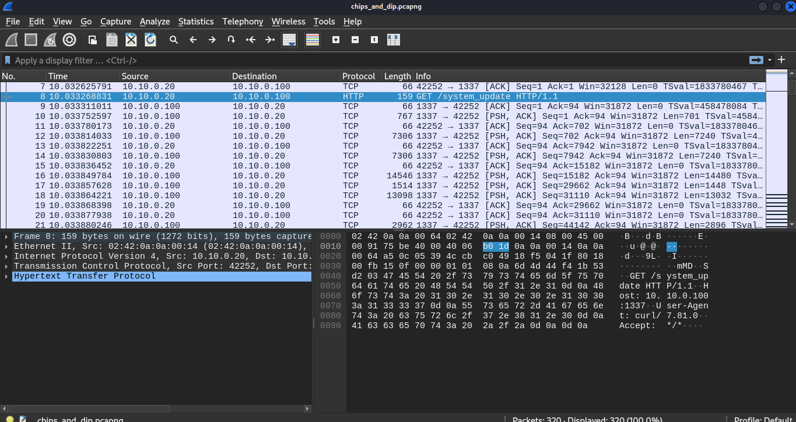

# Forensics: Chips & Dip Redux (481)

The threat actors from last season are back at it again with a new and improved implant that they used to steal the flag. See if you can figure out how to crack it....

Author: [tsuto](https://github.com/jselliott)

**Files:** [chips_and_dip_redux.zip](Files/chips_and_dip_redux.zip)

## Writeup

In this challenge, we're given a zip file we first need to extract...

When we do this, we get a PCAP file and a `.core` file.

The `.core` file is a coredump from a process that provides a snapshot of a process, usually at a time it failed.

Opening the PCAP in Wireshark, we see a lot of TCP at the beginning...



Looking at the TCP stream, we see an ELF file!


If we set the format to raw and save the file, we can then split the file with Python.

Because of the magic bytes, we can use Python in a REPL to get the proper ELF! We know that 0x7f is the start of the ELF file.

```py
with open("file.elf", "rb") as file1:
	with open("complete.elf", "wb") as file2:
		fulldata = file1.read()
		idx = fulldata.find(b"\x7f")
		file2.write(fulldata[idx:])
```

Now, we can start to reverse engineer this with Ghidra!

While that loads, though, we can check out the rest of the PCAP file...

If we look at our other TCP stream, we see some encrypted C2 traffic that contains a nonce and message.


So what we want to look for in the binary is primarily how to decode this.

In Ghidra, we see a `main.salsa_key`...


This, along with repeated references to "salsa20" tells us our cipher, Salsa20! This also matches the nonce and message format of the encrypted data since Salsa20 also sends a nonce.

Anyways, now we need to get this key. Luckily, since we have the `.core` file, we can analyze the program at runtime with GDB, including extracting this key!


Trying to print the key right off the bat throws an error, so first, in GDB, we can load a list of functions with `info functions`. Then `disassemble main.main` to load the labels in that function. 

And then, using `x/s main.salsa_key`, we can get the key!


At this point, CyberChef is great for decrypting our traffic!


This is our traffic:

```
{"MsgType":"getcmd"}
{"MsgType":"cmd","Command":"whoami"}
{"MsgType":"output","Output":"root\n"}
{"MsgType":"getcmd"}
{"MsgType":"cmd","Command":"ip addr show"}
{"MsgType":"output","Output":"exec: \"ip\": executable file not found in $PATH"}
{"MsgType":"getcmd"}
{"MsgType":"cmd","Command":"cat /etc/os-release"}
{"MsgType":"output","Output":"PRETTY_NAME=\"Ubuntu 22.04.4 LTS\"\nNAME=\"Ubuntu\"\nVERSION_ID=\"22.04\"\nVERSION=\"22.04.4 LTS (Jammy Jellyfish)\"\nVERSION_CODENAME=jammy\nID=ubuntu\nID_LIKE=debian\nHOME_URL=\"https://www.ubuntu.com/\"\nSUPPORT_URL=\"https://help.ubuntu.com/\"\nBUG_REPORT_URL=\"https://bugs.launchpad.net/ubuntu/\"\nPRIVACY_POLICY_URL=\"https://www.ubuntu.com/legal/terms-and-policies/privacy-policy\"\nUBUNTU_CODENAME=jammy\n"}
{"MsgType":"getcmd"}
{"MsgType":"cmd","Command":"ls -al /"}
{"MsgType":"output","Output":"total 64\ndrwxr-xr-x   1 root root 4096 Jun  1 18:36 .\ndrwxr-xr-x   1 root root 4096 Jun  1 18:36 ..\n-rwxr-xr-x   1 root root    0 Jun  1 18:36 .dockerenv\ndrwxr-xr-x   1 root root 4096 Jun  1 18:34 app\nlrwxrwxrwx   1 root root    7 Feb 27 15:59 bin -\u003e usr/bin\ndrwxr-xr-x   2 root root 4096 Apr 18  2022 boot\ndrwxr-xr-x   5 root root  340 Jun  1 19:10 dev\ndrwxr-xr-x   1 root root 4096 Jun  1 18:36 etc\n-rw-r--r--   1 root root   29 Jun  1 18:18 flag.txt\ndrwxr-xr-x   2 root root 4096 Apr 18  2022 home\nlrwxrwxrwx   1 root root    7 Feb 27 15:59 lib -\u003e usr/lib\nlrwxrwxrwx   1 root root    9 Feb 27 15:59 lib32 -\u003e usr/lib32\nlrwxrwxrwx   1 root root    9 Feb 27 15:59 lib64 -\u003e usr/lib64\nlrwxrwxrwx   1 root root   10 Feb 27 15:59 libx32 -\u003e usr/libx32\ndrwxr-xr-x   2 root root 4096 Feb 27 15:59 media\ndrwxr-xr-x   2 root root 4096 Feb 27 15:59 mnt\ndrwxr-xr-x   2 root root 4096 Feb 27 15:59 opt\ndr-xr-xr-x 358 root root    0 Jun  1 19:10 proc\ndrwx------   2 root root 4096 Feb 27 16:02 root\ndrwxr-xr-x   5 root root 4096 Feb 27 16:03 run\nlrwxrwxrwx   1 root root    8 Feb 27 15:59 sbin -\u003e usr/sbin\ndrwxr-xr-x   2 root root 4096 Feb 27 15:59 srv\ndr-xr-xr-x  13 root root    0 Jun  1 19:10 sys\ndrwxrwxrwt   1 root root 4096 Jun  1 18:38 tmp\ndrwxr-xr-x   1 root root 4096 Feb 27 15:59 usr\ndrwxr-xr-x   1 root root 4096 Feb 27 16:02 var\n"}
{"MsgType":"getcmd"}
{"MsgType":"cmd","Command":"cat /flag.txt"}
{"MsgType":"output","Output":"SIVUSCG{b4ck_f0r_an0ther_d1p}"}
{"MsgType":"getcmd"}
{"MsgType":"exit","Command":""}
```

And now, we have our flag, `SIVUSCG{b4ck_f0r_an0ther_d1p}`!
