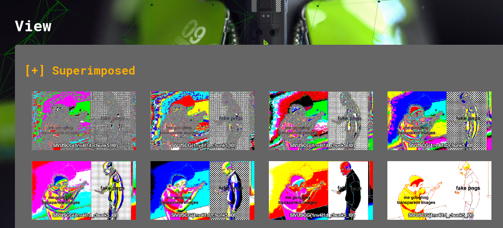

# Forensics: Redundant (100)

My meme got corrupted somehow and cut off the punchline. Can you help?

Author: [tsuto](https://github.com/jselliott)

**Files:** [redundant.png](Files/redundant.png)

## Writeup

Here, we're given an image file we're told is cut off.

Seems similar to steganography, so let's try [Aperi'Solve](https://www.aperisolve.com/)!

And when we upload, we can see this:

And we have our flag, `SIVUSCG{1nv4l1d_chunk5_l0l}`!
