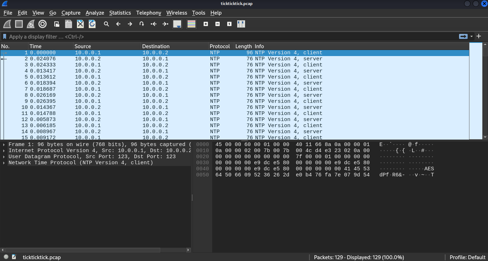
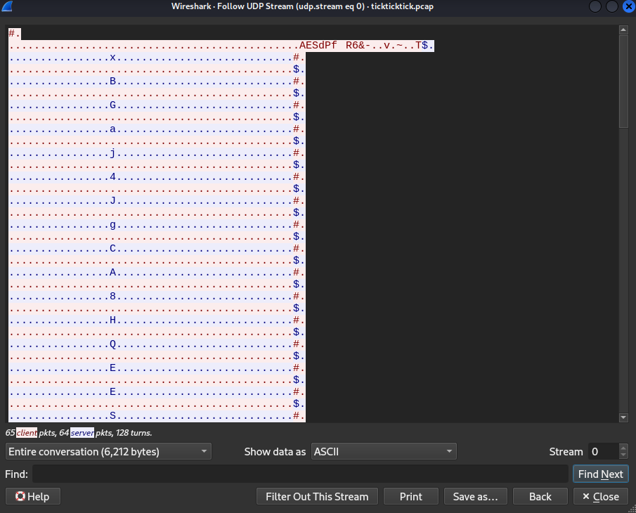
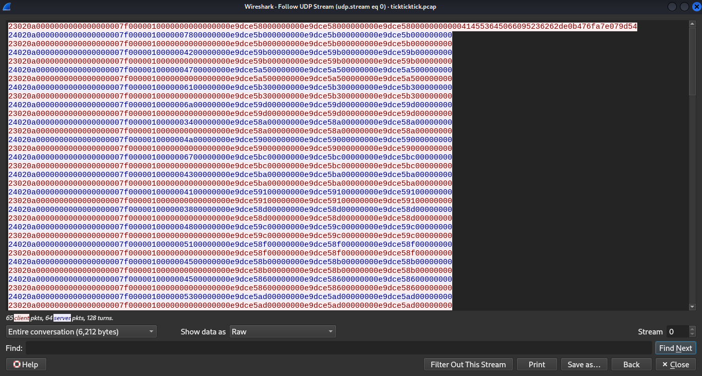
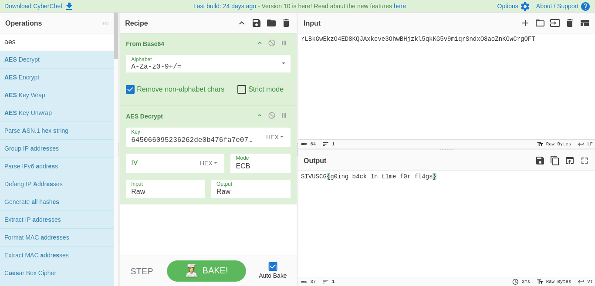

# Forensics: Tick Tick Tick (486)

There's that strange ticking noise again....

Author: [tsuto](https://github.com/jselliott)

**Files:** [tickticktick.pcap](Files/tickticktick.pcap)

## Writeup

For this challenge, we're given a PCAP file with a bunch of NTP traffic.



NTP is why we have this title we have, Tick Tick Tick. NTP is a common protocol used for clock synchronization. However, that's not what's being done here...

We know that somehow, data is being exfiltrated through NTP. To understand more of how, we can look at the UDP stream.



Seeing AES here is interesting... If we switch to raw, which will display hexadecimal, we see even more interesting things...



First, we can look at that first packet:

```
23020a0000000000000000007f0000010000000000000000e9dce58000000000e9dce58000000000e9dce5800000000000414553645066095236262de0b476fa7e079d54
```

This packet is longer than the rest, and ends in `414553645066095236262de0b476fa7e079d54`, which is AES in hex, followed by `645066095236262de0b476fa7e079d54`, which we can presume is our key in hex.

For the other packets, we see first a server packet and then a client packet matching almost exactly except for the first byte and one more byte in the middle. Here's an example:

```
24020a0000000000000000007f0000010000007800000000e9dce5b000000000e9dce5b000000000e9dce5b000000000 (Server)
23020a0000000000000000007f0000010000000000000000e9dce5b000000000e9dce5b000000000e9dce5b000000000 (Client)
```

The first byte, either 24 or 23 in hex, just identifies the client/server, but the other difference is very important. Here, the server shows 78 while the client shows nothing. This is where the data being exfiltrated is encoded. However, also, the `e9dce5b0` is important since that contains the timestamp of the message which can allow us to make sure everything is in order.

Now, we can make a Python script to handle everything else for us! Though, we only need the server packets since the client provides no new information beyond what the server provides.

First, we need to load our data:

```py
data = """24020a0000000000000000007f0000010000007800000000e9dce5b000000000e9dce5b000000000e9dce5b000000000
24020a0000000000000000007f0000010000004200000000e9dce59b00000000e9dce59b00000000e9dce59b00000000
24020a0000000000000000007f0000010000004700000000e9dce5a500000000e9dce5a500000000e9dce5a500000000
24020a0000000000000000007f0000010000006100000000e9dce5b300000000e9dce5b300000000e9dce5b300000000
24020a0000000000000000007f0000010000006a00000000e9dce59d00000000e9dce59d00000000e9dce59d00000000
24020a0000000000000000007f0000010000003400000000e9dce58a00000000e9dce58a00000000e9dce58a00000000
24020a0000000000000000007f0000010000004a00000000e9dce59000000000e9dce59000000000e9dce59000000000
24020a0000000000000000007f0000010000006700000000e9dce5bc00000000e9dce5bc00000000e9dce5bc00000000
24020a0000000000000000007f0000010000004300000000e9dce5ba00000000e9dce5ba00000000e9dce5ba00000000
24020a0000000000000000007f0000010000004100000000e9dce59100000000e9dce59100000000e9dce59100000000
24020a0000000000000000007f0000010000003800000000e9dce58d00000000e9dce58d00000000e9dce58d00000000
24020a0000000000000000007f0000010000004800000000e9dce59c00000000e9dce59c00000000e9dce59c00000000
24020a0000000000000000007f0000010000005100000000e9dce58f00000000e9dce58f00000000e9dce58f00000000
24020a0000000000000000007f0000010000004500000000e9dce58b00000000e9dce58b00000000e9dce58b00000000
24020a0000000000000000007f0000010000004500000000e9dce58600000000e9dce58600000000e9dce58600000000
24020a0000000000000000007f0000010000005300000000e9dce5ad00000000e9dce5ad00000000e9dce5ad00000000
24020a0000000000000000007f0000010000003100000000e9dce5aa00000000e9dce5aa00000000e9dce5aa00000000
24020a0000000000000000007f0000010000003500000000e9dce5a600000000e9dce5a600000000e9dce5a600000000
24020a0000000000000000007f0000010000006500000000e9dce59600000000e9dce59600000000e9dce59600000000
24020a0000000000000000007f0000010000003800000000e9dce5b200000000e9dce5b200000000e9dce5b200000000
24020a0000000000000000007f0000010000004b00000000e9dce5b700000000e9dce5b700000000e9dce5b700000000
24020a0000000000000000007f0000010000007600000000e9dce5a700000000e9dce5a700000000e9dce5a700000000
24020a0000000000000000007f0000010000006c00000000e9dce5a000000000e9dce5a000000000e9dce5a000000000
24020a0000000000000000007f0000010000006400000000e9dce5af00000000e9dce5af00000000e9dce5af00000000
24020a0000000000000000007f0000010000006300000000e9dce59400000000e9dce59400000000e9dce59400000000
24020a0000000000000000007f0000010000004600000000e9dce5be00000000e9dce5be00000000e9dce5be00000000
24020a0000000000000000007f0000010000007200000000e9dce5bb00000000e9dce5bb00000000e9dce5bb00000000
24020a0000000000000000007f0000010000004f00000000e9dce59800000000e9dce59800000000e9dce59800000000
24020a0000000000000000007f0000010000006b00000000e9dce59300000000e9dce59300000000e9dce59300000000
24020a0000000000000000007f0000010000006f00000000e9dce5b400000000e9dce5b400000000e9dce5b400000000
24020a0000000000000000007f0000010000005a00000000e9dce5b500000000e9dce5b500000000e9dce5b500000000
24020a0000000000000000007f0000010000004f00000000e9dce5bd00000000e9dce5bd00000000e9dce5bd00000000
24020a0000000000000000007f0000010000007700000000e9dce58500000000e9dce58500000000e9dce58500000000
24020a0000000000000000007f0000010000004b00000000e9dce58e00000000e9dce58e00000000e9dce58e00000000
24020a0000000000000000007f0000010000004700000000e9dce58400000000e9dce58400000000e9dce58400000000
24020a0000000000000000007f0000010000004700000000e9dce5b800000000e9dce5b800000000e9dce5b800000000
24020a0000000000000000007f0000010000006b00000000e9dce58300000000e9dce58300000000e9dce58300000000
24020a0000000000000000007f0000010000007100000000e9dce5ab00000000e9dce5ab00000000e9dce5ab00000000
24020a0000000000000000007f0000010000005400000000e9dce5bf00000000e9dce5bf00000000e9dce5bf00000000
24020a0000000000000000007f0000010000004f00000000e9dce5b100000000e9dce5b100000000e9dce5b100000000
24020a0000000000000000007f0000010000006e00000000e9dce5b600000000e9dce5b600000000e9dce5b600000000
24020a0000000000000000007f0000010000004200000000e9dce58200000000e9dce58200000000e9dce58200000000
24020a0000000000000000007f0000010000004b00000000e9dce5a400000000e9dce5a400000000e9dce5a400000000
24020a0000000000000000007f0000010000007800000000e9dce59200000000e9dce59200000000e9dce59200000000
24020a0000000000000000007f0000010000007100000000e9dce5a200000000e9dce5a200000000e9dce5a200000000
24020a0000000000000000007f0000010000004400000000e9dce58c00000000e9dce58c00000000e9dce58c00000000
24020a0000000000000000007f0000010000007a00000000e9dce58800000000e9dce58800000000e9dce58800000000
24020a0000000000000000007f0000010000006e00000000e9dce5ae00000000e9dce5ae00000000e9dce5ae00000000
24020a0000000000000000007f0000010000006b00000000e9dce58700000000e9dce58700000000e9dce58700000000
24020a0000000000000000007f0000010000006d00000000e9dce5a900000000e9dce5a900000000e9dce5a900000000
24020a0000000000000000007f0000010000007700000000e9dce5b900000000e9dce5b900000000e9dce5b900000000
24020a0000000000000000007f0000010000004f00000000e9dce58900000000e9dce58900000000e9dce58900000000
24020a0000000000000000007f0000010000006b00000000e9dce59f00000000e9dce59f00000000e9dce59f00000000
24020a0000000000000000007f0000010000003500000000e9dce5a100000000e9dce5a100000000e9dce5a100000000
24020a0000000000000000007f0000010000003300000000e9dce59700000000e9dce59700000000e9dce59700000000
24020a0000000000000000007f0000010000006800000000e9dce59900000000e9dce59900000000e9dce59900000000
24020a0000000000000000007f0000010000006b00000000e9dce5a300000000e9dce5a300000000e9dce5a300000000
24020a0000000000000000007f0000010000007600000000e9dce59500000000e9dce59500000000e9dce59500000000
24020a0000000000000000007f0000010000004c00000000e9dce58100000000e9dce58100000000e9dce58100000000
24020a0000000000000000007f0000010000003900000000e9dce5a800000000e9dce5a800000000e9dce5a800000000
24020a0000000000000000007f0000010000007700000000e9dce59a00000000e9dce59a00000000e9dce59a00000000
24020a0000000000000000007f0000010000007200000000e9dce58000000000e9dce58000000000e9dce58000000000
24020a0000000000000000007f0000010000007200000000e9dce5ac00000000e9dce5ac00000000e9dce5ac00000000
24020a0000000000000000007f0000010000007a00000000e9dce59e00000000e9dce59e00000000e9dce59e00000000"""
```

And to split our data into lines:
```py
data = data.split('\n')
```

Now, we can parse through to extract the encoded bytes and the timestamp:

```py
# Create list for parsed data
parsed = []
# Loop through lines
for line in data:
	# Get encoded byte
	code = line[38:40]
	# Get timestamp
	timestamp = int('0x' + line[48:56], 0)
	# Add parsed data
	parsed.append((code, timestamp))
```

And lastly, to sort by timestamp and print the result!

```py
# Sort by timestamp
sortCondition = lambda e: e[1]
parsed.sort(key = sortCondition)

# Hex to text
print(bytes.fromhex(''.join([x[0] for x in parsed])))
```

Running this, we get `rLBkGwEkzO4ED8KQJAxkcve3OhwBHjzkl5qkKG5v9m1qrSndxO8aoZnKGwCrgOFT` which we can now put into CyberChef!

Since we aren't given an IV, we can assume "AES" refers to "AES-ECB" specifically, and we get this:



And we have our flag, `SIVUSCG{g0ing_b4ck_1n_t1me_f0r_fl4gs}`! 
