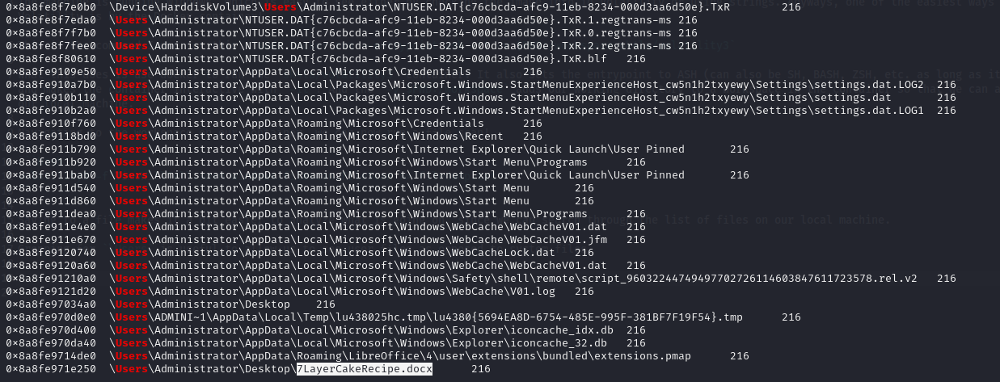

# Forensics: Time Will Tell (499)

I was reading the recipe document for my famous 7 Layer Cake. 

Lots of layers...like this challenge.

Author: r0m

To start, we get a `.vmem` file, indicating that we have a memory dump! Therefore, we should start by analyzing this with Volatility!

The machine is running Windows, which is easy to see either by checking the image info in Volatility or using strings. Anyways, one of the easiest ways to use Volatility is by the Docker container!

This is the command I use for this: `sudo docker run --entrypoint ash -it -v $PWD:/workspace sk4la/volatility3`

What this does is use docker to run the `sk4la/volatility3` container. It also sets the entrypoint to ASH (can also be SH, BASH, ZSH, etc. as long as it's installed) and makes the container interactive with `-it`! And the `-v $PWD:/workspace` adds our working directory to a workspace in the container so that we can analyze files on our local machine.

Navigating to the workspace on our container, we can now run a file scan!

```bash
volatility3 -f TimeWillTell.vmem windows.filescan.FileScan >> filedump.txt
```

Saving to a file makes it a bit easier to analyze what is going on, since we can search through the list of files on our local machine.


Grepping for `\Users` is useful to allow us to see user files as opposed to system files.

Doing this, one file stands out:



`7LayerCakeRecipe.docx` sounds a lot like the 7 layer cake mentioned in the description! Let's try to download it! The virtual address is `0x8a8fe971e250`

So, we can run `volatility3 -f TimeWillTell.vmem windows.dumpfiles.DumpFiles --virtaddr=0x8a8fe971e250`


Unfortunately, we end up getting a `.dat` and `.vacb` file

Luckily, we can combine these images!


And opening in LibreOffice Write, we see an interesting set of clocks that say they link to a file on GitHub.


These clocks all link to hexadecimal values for character codes, but we technically don't need that. An easier way is to just find the author's GitHub!

Our author is `r0m` or David Morgan. 

We can also find his Twitter account from the Season III US Cyber Games coaches website!


While we need an account (I just used one I've used for OSINT challenges in the past), when we log in, we can find this post:


And when we head to his profile and repositories page, we see something interesting: 


In this C file, we can see some code that appears to be XOR-encoded with a key of 0x5A.


We plug into CyberChef and find this:


And with Base64...


And we have our flag, `SIVUSCG{th4t_w4s_4l0t_0f_$t3p$}`!