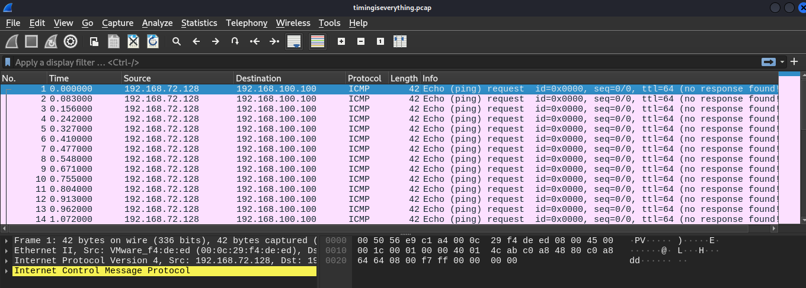
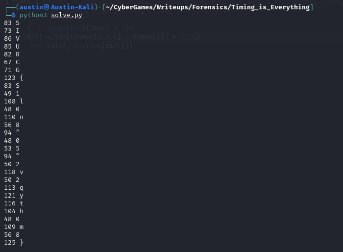

# Forensics: Timing is Everything (100)

Timing is everything....

Author: r0m

In this challenge, we're given a PCAP file with ICMP requests...



Nothing seems to be different between the ICMP requests except for the timing... Maybe timing really is everything?

These are the times:

0.000
0.083
0.156
0.242
0.327
0.410
0.477
0.548
0.671
0.755
0.804
0.913
0.962
1.072
1.129
1.224
1.273
1.326
1.421
1.472
1.590
1.641
1.755
1.876
1.992
2.096
2.145
2.255
2.312
2.437

What if the differences between the times gives the flag?

Let's write a Python script:

```py
times = [0.000, 0.083, 0.156, 0.242, 0.327, 0.410, 0.477, 0.548, 0.671, 0.755, 0.804, 0.913, 0.962, 1.072, 1.129, 1.224, 1.273, 1.326, 1.421, 1.472, 1.590, 1.641, 1.755, 1.876, 1.992, 2.096, 2.145, 2.255, 2.312, 2.437]

for i in range(len(times) - 1):
	diff = int((times[i + 1] - times[i]) * 1000)
	print(diff, chr(int(diff * 1000)))
```

Running this program, we get this:



So this is close but slightly off...

We got this: `SIVURCG{S1l0n8^05^2v2qyth0m8}`

Some of these are just one off...

We know R is next to S, so it should start `SIVUSCG{`... We also know the `^`s should be underscores...

For the rest, it looks to say `SIVUSCG{T1m1n9_15_3v3ryth1n9}`, which is our flag! Just a few off by one, which is the toughest part!
