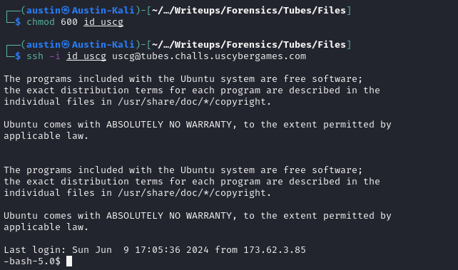
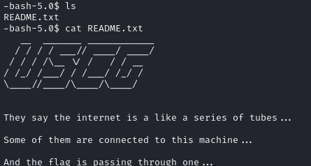
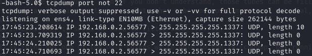
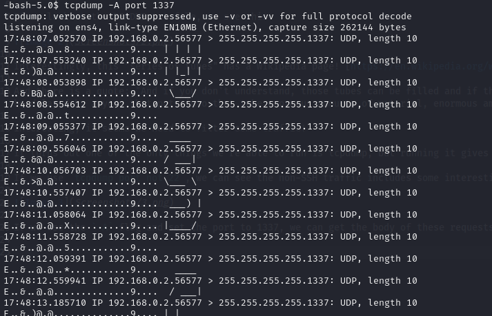

# Forensics: Tubes (100)

The internet is a series of tubes...

*ssh -i id_uscg uscg@tubes.challs.uscybergames.com*

In this challenge, we're given an RSA key and an SSH user and host.

We need to change the permissions of the key by using `chmod 600 id_uscg`, but once we do this, we can connect!

If we look at the README.txt file, we see this:

Interestingly, this "series of tubes" has a Wikipedia page! [https://en.wikipedia.org/wiki/Series_of_tubes](https://en.wikipedia.org/wiki/Series_of_tubes)

And there is a quote: "And if you don't understand, those tubes can be filled and if they are filled, when you put your message in, it gets in line and it's going to be delayed by anyone that puts into that tube enormous amounts of material, enormous amounts of material."

Interesting, it seems we need to filter some traffic!

It turns out one of the only things we're able to run is tcpdump, but running it gives us a bunch of junk (no screenshot to prevent from exposing IPs)...

If we use `tcpdump port not 22`, we can see the non-SSH traffic includes some interesting requests from port 1337...

If we use the `-A` flag and set the port to 1337, we can get the body of these requests...

This seems interesting... By following this ASCII art, we can get the flag! `SIVUSCG{t0t4lly_tub4l4r}`!