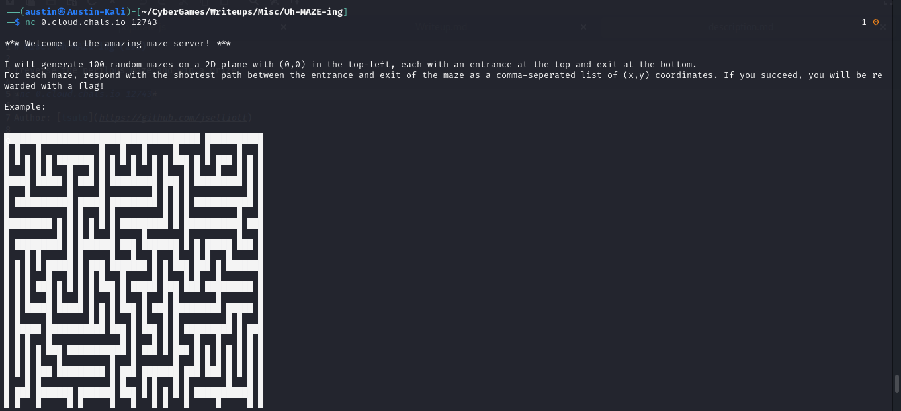
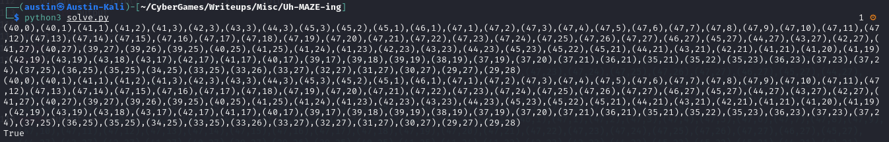
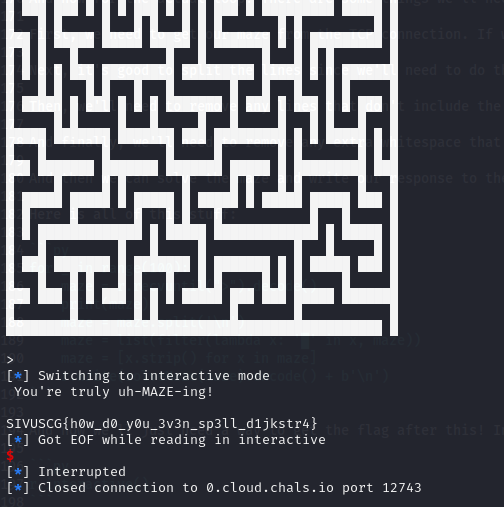

# Misc: Uh-MAZE-ing (293)

Treverse the perilous maze and win a prize!

*nc 0.cloud.chals.io 12743*

Author: [tsuto](https://github.com/jselliott)

Since we were given a netcat host and port, the first thing we need to do is check it out!



So, we'll need to solve 100 mazes super quickly! There's no way we can do this manually, so we'll need to write a program to solve these mazes.

First, let's see if we can solve that first maze. 

We can hardcode an example maze into our program for testing...

```py
maze = """████████████████████████████████████████ ████████
█   █         █             █     █         █   █
███ █████ ███ ███ █████████ █ ███ █ █████ ███ █ █
█   █     █ █   █ █       █   █ █ █ █   █     █ █
█ ███ █████ ███ █ ███████ █████ █ █ █ █ ███████ █
█     █     █   █   █   █       █ █ █ █     █ █ █
███████ ███ █ █████ █ █ ███████ █ █ █████ █ █ █ █
█   █   █ █   █   █   █     █   █ █     █ █   █ █
█ █ █ ███ ███████ █████████ █ ███ █████ █ █████ █
█ █   █ █       █           █ █   █   █ █ █   █ █
█ █████ █ █ ███ █████ ███████ █ ███ █ █ █ █ █ █ █
█     █   █ █ █     █ █   █   █     █   █   █ █ █
█████ █████ █ █████ █ █ █ ███ ███████████ ███ █ █
█   █ █     █ █     █   █       █       █   █ █ █
█ ███ █ █████ █ ███████████████ █████ █ █████ █ █
█     █     █     █     █     █     █ █       █ █
█ █████ ███ █████ █ █ █ █ ███ █████ █ ███████ █ █
█   █     █   █   █ █ █ █ █   █   █   █     █ █ █
███ ███ █████ ███ ███ █ ███ ███ █ █ ███ ███ █ █ █
█ █   █ █   █   █     █   █     █   █   █   █ █ █
█ ███ ███ █ █ █ █████████ █ █████████ ███ █████ █
█ █   █   █ █ █   █     █ █       █   █ █     █ █
█ █ ███ ███ █████ █ ███ █ ███████ █ ███ █████ █ █
█ █ █   █ █ █   █ █   █ █     █   █   █ █     █ █
█ █ █ ███ █ █ █ █ ███ █ █████ █ █████ █ █ █████ █
█ █ █ █ █   █ █ █     █ █   █ █ █     █   █     █
█ █ █ █ █ ███ █ ███████ █ █ █ ███ █████ ███████ █
█     █       █         █ █       █             █
█████████████████████████████ ███████████████████"""
```

To allow us to read the individual lines, it's also a good idea to split the lines of the maze into a list.

```py
maze = maze.split('\n')
```

There are multiple ways to solve mazes, including famously Dijkstra's Algorithm, but one of the easiest ways is to just try every possible option! In a maze, you can always move forward, to the right, or to the left (going backwards doesn't make sense since you were just there) as long as there isn't a wall, so by programmatically finding which directions are possible and making a clone of our maze solver go in each direction, it can be pretty easy to solve! 

Though, we will need to save the path it went in so we can send that to our challenge environment. Anyways, the fastest path will be the first to return, so at that point we can just break out of a function and return the first result that we get!

Here's an example function that takes in a maze similar to our maze variable and solves it:
```py
def solveMaze(maze):
	# Allows us to convert the direction from the current point into the next point.
	def getDirection(x, y, direction):
		if direction == 0:
			return [x, y - 1]
		elif direction == 1:
			return [x + 1, y]
		elif direction == 2:
			return [x, y + 1]
		else:
			return [x - 1, y]

	# Checks the moves possible from a given point and direction.
	def checkMoves(x, y, direction):
		# If we hit a wall, we can't do anything...
		if maze[y][x] == '█':
			return []
		else:
			# Directions: 0 up, 1 right, 2 down, 3 left
			checkStraight = direction
			checkLeft = (direction - 1) % 4
			checkRight = (direction + 1) % 4
			moves = []
			
			# Check moves just going straight (note that we need to check that the new point is possible first)
			checkX, checkY = getDirection(x, y, checkStraight)
			if checkY < len(maze) and checkY >= 0 and checkX < len(maze[0]) and checkX >= 0 and maze[checkY][checkX] != '█':
				moves.append([checkX, checkY, checkStraight])
			
			# Check for going left
			checkX, checkY = getDirection(x, y, checkLeft)
			if checkY < len(maze) and checkY >= 0 and checkX < len(maze[0]) and checkX >= 0 and  maze[checkY][checkX] != '█':
				moves.append([checkX, checkY, checkLeft])
				
			# Check for going right
			checkX, checkY = getDirection(x, y, checkRight)
			if checkY < len(maze) and checkY >= 0 and checkX < len(maze[0]) and checkX >= 0 and  maze[checkY][checkX] != '█':
				moves.append([checkX, checkY, checkRight])
			
			# Return all our possible moves from this point (can contain straight, left, or right)
			return moves

	# Now for actually solving this maze!
	
	# First, we need to find our starting point. We know it's on the first row, but need to find the x.
	startX = 0
	# We always need to check going down, so we'll go ahead and do that until we get an x that works!
	while len(checkMoves(startX, 0, 2)) == 0:
		startX += 1

	# We'll start at our starting point, going down. The last item of our first coordinate is the path followed which is empty at the start.
	coords = [[startX, 0, 2, []]]
	# Saves if we have a solution.
	solutionFound = False
	# Saves what the solution is
	soln = 0
	while not solutionFound:
		# This list stores our new coordinates that will then become the coordinates for the next iteration
		new_coords = []
		# Loop through the positions we're at right now
		for x, y, direction, path in coords:
			# If we're at the bottom of the maze, we have our solution!
			if y == len(maze) - 1:
				soln = path + [[x,y]]
				solutionFound = True
				break
			# But if we don't have it yet...
			
			# Adds our current point to the saved path
			new_path = path + [[x, y]]
			
			# Loop through possible moves and add them to new_coords
			for move in checkMoves(x, y, direction):
				new_coords.append(move + [new_path])
		# Set coords to new_coords for next iteration
		coords = new_coords
	
	# Format output and return
	output = ",".join(f"({x},{y})" for x,y in soln)
	return output
```

And now, let's test this against our expected solution, given by the netcat connection! 

```py
output = solveMaze(maze)
print(output)
print("(40,0),(40,1),(41,1),(41,2),(41,3),(42,3),(43,3),(44,3),(45,3),(45,2),(45,1),(46,1),(47,1),(47,2),(47,3),(47,4),(47,5),(47,6),(47,7),(47,8),(47,9),(47,10),(47,11),(47,12),(47,13),(47,14),(47,15),(47,16),(47,17),(47,18),(47,19),(47,20),(47,21),(47,22),(47,23),(47,24),(47,25),(47,26),(47,27),(46,27),(45,27),(44,27),(43,27),(42,27),(41,27),(40,27),(39,27),(39,26),(39,25),(40,25),(41,25),(41,24),(41,23),(42,23),(43,23),(44,23),(45,23),(45,22),(45,21),(44,21),(43,21),(42,21),(41,21),(41,20),(41,19),(42,19),(43,19),(43,18),(43,17),(42,17),(41,17),(40,17),(39,17),(39,18),(39,19),(38,19),(37,19),(37,20),(37,21),(36,21),(35,21),(35,22),(35,23),(36,23),(37,23),(37,24),(37,25),(36,25),(35,25),(34,25),(33,25),(33,26),(33,27),(32,27),(31,27),(30,27),(29,27),(29,28)")
print(output == "(40,0),(40,1),(41,1),(41,2),(41,3),(42,3),(43,3),(44,3),(45,3),(45,2),(45,1),(46,1),(47,1),(47,2),(47,3),(47,4),(47,5),(47,6),(47,7),(47,8),(47,9),(47,10),(47,11),(47,12),(47,13),(47,14),(47,15),(47,16),(47,17),(47,18),(47,19),(47,20),(47,21),(47,22),(47,23),(47,24),(47,25),(47,26),(47,27),(46,27),(45,27),(44,27),(43,27),(42,27),(41,27),(40,27),(39,27),(39,26),(39,25),(40,25),(41,25),(41,24),(41,23),(42,23),(43,23),(44,23),(45,23),(45,22),(45,21),(44,21),(43,21),(42,21),(41,21),(41,20),(41,19),(42,19),(43,19),(43,18),(43,17),(42,17),(41,17),(40,17),(39,17),(39,18),(39,19),(38,19),(37,19),(37,20),(37,21),(36,21),(35,21),(35,22),(35,23),(36,23),(37,23),(37,24),(37,25),(36,25),(35,25),(34,25),(33,25),(33,26),(33,27),(32,27),(31,27),(30,27),(29,27),(29,28)")
```



And it works!

Now just to generalize it and automate the connection to our listener!

First, we'll need to import pwntools at the beginning. pwntools makes it way easier to handle TCP connections like this through Python, although we could still use normal sockets!

```py
from pwn import *
```

And to start our connection...

```py
r = remote("0.cloud.chals.io", 12743)
```

Now, we need to loop 100 times to solve our 100 mazes. Though, before we loop, we need to get past the introduction. The "Here we go..." message is pretty easy to identify and we can just use `recvuntil` to get past it!

```py
print(r.recvuntil("Here we go...").decode())
```

And now for the actual loop! There are some things we'll need to do before we solve it.

First, we need to get our maze from the TCP connection. If we use `recvuntil` until the prompt, ">", this is pretty easy.

Next, it's good to split the lines since we'll need to do that anyways...

Then, we'll need to remove any lines that don't include the maze. All lines of the maze will have a wall, so we can just filter out lines that don't have one.

And finally, we'll need to remove any extra whitespace that might show up from weird formatting.

And then we can solve the maze and write our response to the TCP connection!

Here is all of this stuff:

```py
for _ in range(100):
	maze = r.recvuntil(">").decode()
	print(maze)
	maze = maze.split('\n')
	maze = list(filter(lambda x: '█' in x, maze))
	maze = [x.strip() for x in maze]
	r.write(solveMaze(maze).encode() + b'\n')
```

And now we'll just need a way to get the flag after this! Interactive mode is super useful here.

```py
r.interactive()
```

And now we can run and get the flag!



And we have our flag, `SIVUSCG{h0w_d0_y0u_3v3n_sp3ll_d1jkstr4}`!

This gives a little nod to Dijkstra's Algorithm, which we didn't use but is very useful for a lot of maze solving!