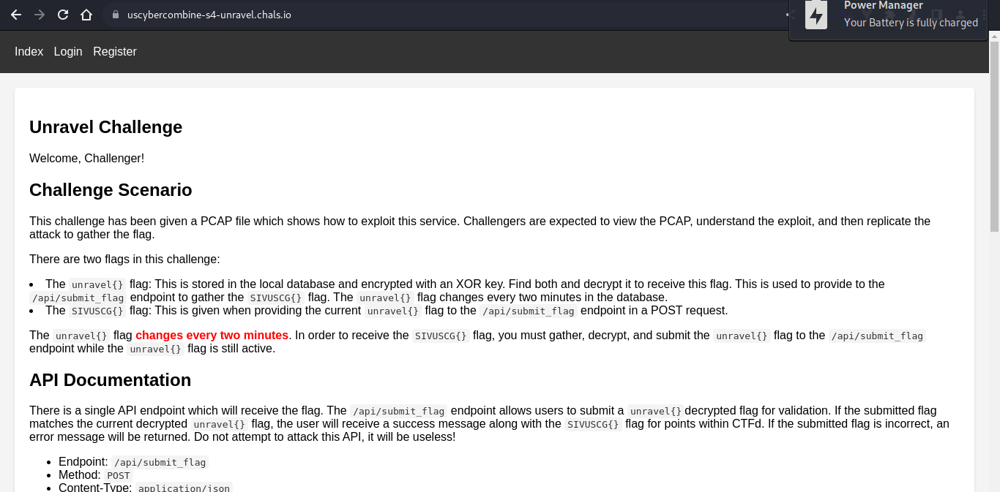

# Misc: Unravel (100)

This challenge has several parts. You are given a PCAP which shows how to attack the service provided below. Reverse the attack to gather and decrypt an `unravel{}` flag, then provide that to the API (`/api/submit_flag`) to gain the `SIVUSCG{}` flag to submit here.

Additional details are provided on the index page of the challenge.

[https://uscybercombine-s4-unravel.chals.io/](https://uscybercombine-s4-unravel.chals.io/)

So, for this challenge, we have two things: a PCAP file and a website.

First, we can open Wireshark to look through the PCAP.

All of our traffic is TCP, so we can just use the TCP stream to make analysis a bit easier!

We have multiple TCP streams for each HTTP request. Our first shows registering a user. However, there is also another param: `secret_param=admin_secret`

And our second shows logging in as that user!

The third shows an interesting request that seems to exploit an SQL injection vulnerability...

This is the path used: `/admin/products?search=widget%27%20UNION%20SELECT%20NULL,xor_encrypted_flag,NULL,NULL%20FROM%20xord_flag--`

And the fourth shows a similar request that seems to get an encryption key for this flag!

This is the path that is used: `/admin/products?search=widget%27%20UNION%20SELECT%20NULL,key,NULL,NULL%20FROM%20xor_encryption_key--`

And the last submits the decrypted flag!

And now to do it ourselves! We'll need to start at the website.

There's some information here, but we don't need it really that much... Instead, we can just register and log in!

For registering, we can use BurpSuite to capture the request and change the parameter!

After registering, we can log in!

Now, we'll need to use our two SQL injection paths, and then quickly submit our flag before it expires!

So we can open both of these and then open CyberChef to XOR decrypt. Then, fetch in JavaScript is an easy way to submit the flag!

And now we have our flag, `SIVUSCG{r3vers3_att@cks_c@sh_ch3cks}`!
