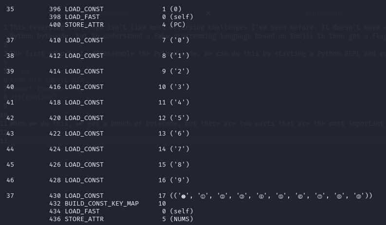
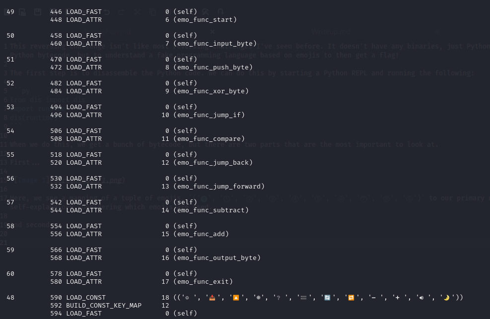
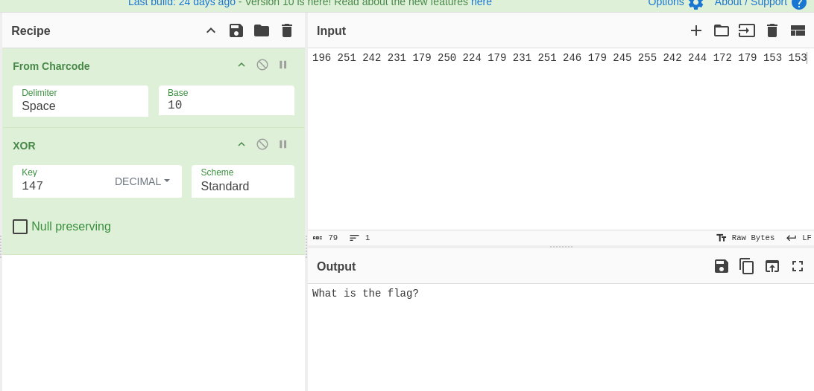
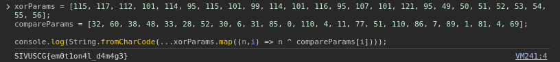
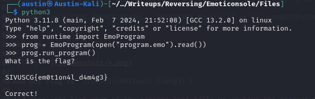

# Reverse Engineering: Emoticonsole (269)

Finally, a programming language that is Gen Z approved!

Author: [tsuto](https://github.com/jselliott)

**Files:** [program.emo](Files/program.emo), [runtime.pyc](Files/runtime.pyc)

## Writeup

This reversing challenge isn't like most reversing challenges I've seen before. It doesn't have any binaries, just Python bytecode. And the goal isn't to reverse the Python bytecode, but to understand a fake programming language based on emojis to then get a flag! 

The first step is to disassemble the Python code. We can do this by starting a Python REPL and running the following:

```py
from dis import dis
import runtime
dis(runtime)
```

When we do this, we get a bunch of bytecode, but there are two parts that are the most important to look at.

First...



Here, we see a mapping of a tuple of emojis, `('⓿', '⓵', '⓶', '⓷', '⓸', '⓹', '⓺', '⓻', '⓼', '⓽')` to our primary numerical digits. This is useful, although self-explanatory considering which emojis are used.

And second...



Now, here, we see what our functions are, specifically a mapping of `('🌞', '📥', '🔼', '⊕', '❔', '🟰', '🔄', '🔁', '➖', '➕', '🔊', '🌛')` to functions for the start of the program, reading input, pushing a value to the stack, XOR, conditionals, comparison, jumping backward, jumping forward, subtracting, adding, printing output, and ending the program.

And then it's important to look at our `program.emo` file...

```
🌞🔼⓵⓹⓷🔼⓵⓹⓷🔼⓵⓻⓽🔼⓵⓻⓶🔼⓶⓸⓸🔼⓶⓸⓶🔼⓶⓹⓹🔼⓶⓸⓹🔼⓵⓻⓽🔼⓶⓸⓺🔼⓶⓹⓵🔼⓶⓷⓵🔼⓵⓻⓽🔼⓶⓶⓸🔼⓶⓹⓿🔼⓵⓻⓽🔼⓶⓷⓵🔼⓶⓸⓶🔼⓶⓹⓵🔼⓵⓽⓺🔼⓵⓸⓻⊕🔊🔼⓵⓸⓻⊕🔊🔼⓵⓸⓻⊕🔊🔼⓵⓸⓻⊕🔊🔼⓵⓸⓻⊕🔊🔼⓵⓸⓻⊕🔊🔼⓵⓸⓻⊕🔊🔼⓵⓸⓻⊕🔊🔼⓵⓸⓻⊕🔊🔼⓵⓸⓻⊕🔊🔼⓵⓸⓻⊕🔊🔼⓵⓸⓻⊕🔊🔼⓵⓸⓻⊕🔊🔼⓵⓸⓻⊕🔊🔼⓵⓸⓻⊕🔊🔼⓵⓸⓻⊕🔊🔼⓵⓸⓻⊕🔊🔼⓵⓸⓻⊕🔊🔼⓵⓸⓻⊕🔊🔼⓵⓸⓻⊕🔊📥🔼⓵⓵⓹⊕🔼⓿⓷⓶🟰❔🌛📥🔼⓵⓵⓻⊕🔼⓿⓺⓿🟰❔🌛📥🔼⓵⓵⓶⊕🔼⓿⓷⓼🟰❔🌛📥🔼⓵⓿⓵⊕🔼⓿⓸⓼🟰❔🌛📥🔼⓵⓵⓸⊕🔼⓿⓷⓷🟰❔🌛📥🔼⓿⓽⓹⊕🔼⓿⓶⓼🟰❔🌛📥🔼⓵⓵⓹⊕🔼⓿⓹⓶🟰❔🌛📥🔼⓵⓿⓵⊕🔼⓿⓷⓿🟰❔🌛📥🔼⓿⓽⓽⊕🔼⓿⓿⓺🟰❔🌛📥🔼⓵⓵⓸⊕🔼⓿⓷⓵🟰❔🌛📥🔼⓵⓿⓵⊕🔼⓿⓼⓹🟰❔🌛📥🔼⓵⓵⓺⊕🔼⓿⓿⓿🟰❔🌛📥🔼⓿⓽⓹⊕🔼⓵⓵⓿🟰❔🌛📥🔼⓵⓿⓻⊕🔼⓿⓿⓸🟰❔🌛📥🔼⓵⓿⓵⊕🔼⓿⓵⓵🟰❔🌛📥🔼⓵⓶⓵⊕🔼⓿⓻⓻🟰❔🌛📥🔼⓿⓽⓹⊕🔼⓿⓹⓵🟰❔🌛📥🔼⓿⓸⓽⊕🔼⓵⓵⓿🟰❔🌛📥🔼⓿⓹⓿⊕🔼⓿⓼⓺🟰❔🌛📥🔼⓿⓹⓵⊕🔼⓿⓿⓻🟰❔🌛📥🔼⓿⓹⓶⊕🔼⓿⓼⓽🟰❔🌛📥🔼⓿⓹⓷⊕🔼⓿⓿⓵🟰❔🌛📥🔼⓿⓹⓸⊕🔼⓿⓼⓵🟰❔🌛📥🔼⓿⓹⓹⊕🔼⓿⓿⓸🟰❔🌛📥🔼⓿⓹⓺⊕🔼⓿⓺⓽🟰❔🌛🔼⓵⓻⓼🔼⓶⓷⓵🔼⓶⓸⓿🔼⓶⓸⓺🔼⓶⓶⓹🔼⓶⓶⓹🔼⓶⓹⓶🔼⓶⓿⓼🔼⓵⓹⓷🔼⓵⓸⓻⊕🔊🔼⓵⓸⓻⊕🔊🔼⓵⓸⓻⊕🔊🔼⓵⓸⓻⊕🔊🔼⓵⓸⓻⊕🔊🔼⓵⓸⓻⊕🔊🔼⓵⓸⓻⊕🔊🔼⓵⓸⓻⊕🔊🔼⓵⓸⓻⊕🔊🌛
```

So, let's break this up...

First, this part:

```
🌞🔼⓵⓹⓷🔼⓵⓹⓷🔼⓵⓻⓽🔼⓵⓻⓶🔼⓶⓸⓸🔼⓶⓸⓶🔼⓶⓹⓹🔼⓶⓸⓹🔼⓵⓻⓽🔼⓶⓸⓺🔼⓶⓹⓵🔼⓶⓷⓵🔼⓵⓻⓽🔼⓶⓶⓸🔼⓶⓹⓿🔼⓵⓻⓽🔼⓶⓷⓵🔼⓶⓸⓶🔼⓶⓹⓵🔼⓵⓽⓺🔼⓵⓸⓻⊕🔊🔼⓵⓸⓻⊕🔊🔼⓵⓸⓻⊕🔊🔼⓵⓸⓻⊕🔊🔼⓵⓸⓻⊕🔊🔼⓵⓸⓻⊕🔊🔼⓵⓸⓻⊕🔊🔼⓵⓸⓻⊕🔊🔼⓵⓸⓻⊕🔊🔼⓵⓸⓻⊕🔊🔼⓵⓸⓻⊕🔊🔼⓵⓸⓻⊕🔊🔼⓵⓸⓻⊕🔊🔼⓵⓸⓻⊕🔊🔼⓵⓸⓻⊕🔊🔼⓵⓸⓻⊕🔊🔼⓵⓸⓻⊕🔊🔼⓵⓸⓻⊕🔊🔼⓵⓸⓻⊕🔊🔼⓵⓸⓻⊕🔊
```

First, in reading this, we can learn something interesting about the structure of this programming language. It seems to be heavily based on the stack, similar to the language from the 70s, Forth. So, pushing to the stack is very important, hence why it is done a bunch of times. And after we're done pushing to the stack, we see a series of pushing 147 to the stack and applying XOR and printing, suggesting that what we are doing is really just taking the XOR stream of all the bytes pushed to the stack... Let's see with CyberChef!



And it seems we're right! All this section does is ask us for the flag!

Now, the next interesting segment of the program (and the most important) is this:

```
📥🔼⓵⓵⓹⊕🔼⓿⓷⓶🟰❔🌛📥🔼⓵⓵⓻⊕🔼⓿⓺⓿🟰❔🌛📥🔼⓵⓵⓶⊕🔼⓿⓷⓼🟰❔🌛📥🔼⓵⓿⓵⊕🔼⓿⓸⓼🟰❔🌛📥🔼⓵⓵⓸⊕🔼⓿⓷⓷🟰❔🌛📥🔼⓿⓽⓹⊕🔼⓿⓶⓼🟰❔🌛📥🔼⓵⓵⓹⊕🔼⓿⓹⓶🟰❔🌛📥🔼⓵⓿⓵⊕🔼⓿⓷⓿🟰❔🌛📥🔼⓿⓽⓽⊕🔼⓿⓿⓺🟰❔🌛📥🔼⓵⓵⓸⊕🔼⓿⓷⓵🟰❔🌛📥🔼⓵⓿⓵⊕🔼⓿⓼⓹🟰❔🌛📥🔼⓵⓵⓺⊕🔼⓿⓿⓿🟰❔🌛📥🔼⓿⓽⓹⊕🔼⓵⓵⓿🟰❔🌛📥🔼⓵⓿⓻⊕🔼⓿⓿⓸🟰❔🌛📥🔼⓵⓿⓵⊕🔼⓿⓵⓵🟰❔🌛📥🔼⓵⓶⓵⊕🔼⓿⓻⓻🟰❔🌛📥🔼⓿⓽⓹⊕🔼⓿⓹⓵🟰❔🌛📥🔼⓿⓸⓽⊕🔼⓵⓵⓿🟰❔🌛📥🔼⓿⓹⓿⊕🔼⓿⓼⓺🟰❔🌛📥🔼⓿⓹⓵⊕🔼⓿⓿⓻🟰❔🌛📥🔼⓿⓹⓶⊕🔼⓿⓼⓽🟰❔🌛📥🔼⓿⓹⓷⊕🔼⓿⓿⓵🟰❔🌛📥🔼⓿⓹⓸⊕🔼⓿⓼⓵🟰❔🌛📥🔼⓿⓹⓹⊕🔼⓿⓿⓸🟰❔🌛📥🔼⓿⓹⓺⊕🔼⓿⓺⓽🟰❔🌛
```

Here, we see another interesting pattern. We read input, push a number, XOR, push another number, compare, and what we can assume about the "if" function is that it jumps past if true, so if the two numbers are not equal, it exits the program. This is a pure guess, but we can test it here.

So to take this out of the terms of the stack, it checks if the input XOR the first number equals the second number. If we look at the first example, input XOR 115 = 32, so we can XOR 32 instead to get 83, or the character "S", which is the start of our `SIVUSCG{}` flag format!

Now, an easy way to do this is to write a JS program to quickly give us what we need by XOR'ing everything.

```javascript
xorParams = [115, 117, 112, 101, 114, 95, 115, 101, 99, 114, 101, 116, 95, 107, 101, 121, 95, 49, 50, 51, 52, 53, 54, 55, 56];
compareParams = [32, 60, 38, 48, 33, 28, 52, 30, 6, 31, 85, 0, 110, 4, 11, 77, 51, 110, 86, 7, 89, 1, 81, 4, 69];

console.log(String.fromCharCode(...xorParams.map((n,i) => n ^ compareParams[i])));
```

And now, we can get the flag!



And our flag is `SIVUSCG{em0t1on4l_d4m4g3}`!

And also, the last part of the program just tells us we have the correct flag.

We can show this by running the program!

```py
from runtime import EmoProgram
prog = EmoProgram(open("program.emo").read())
prog.run_program()
```


