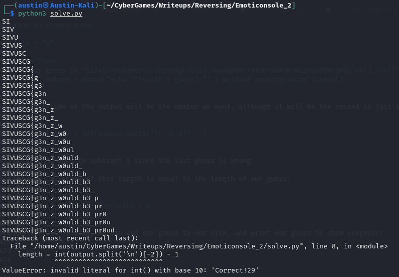

# Reverse Engineering: Emoticonsole 2 (481)

Our new emoji-powered PC has advanced significantly since the last release after some feedback from our Gen-Z interns.

Author: [tsuto](https://github.com/jselliott)

**Files:** [program.emo](Files/program.emo), [runtime.pyc](Files/runtime.pyc)

## Writeup

This challenge is a sequel to another challenge in this CTF, Emoticonsole. The process of solving it is similar, but we have both a more complex language and a more complex program.

It is possible to solve this statically, that is by just reading the code in emojis, but it is much easier to solve this dynamically.

First, we'll need to disassemble our interpreter. We can do this by running the following in a Python REPL:

```py
from dis import dis
import runtime
dis(runtime)
```

Here, we see some interesting things...

First, when we see the following, we can understand how numbers work:

```
 64         750 LOAD_CONST              24 (('⓿', '⓵', '⓶', '⓷', '⓸', '⓹', '⓺', '⓻', '⓼', '⓽'))
            752 BUILD_CONST_KEY_MAP     10
            754 LOAD_FAST                0 (self)
            756 STORE_ATTR               8 (NUMS)
```

They work the exact same as Emoticonsole!

Then, we can find our definitions of our functions.

```
 75         766 BUILD_MAP                0

 76         768 LOAD_CONST              25 ('🌞')
            770 LOAD_FAST                0 (self)
            772 LOAD_ATTR                9 (emo_func_start)

 75         782 MAP_ADD                  1

 77         784 LOAD_CONST              26 ('📥')
            786 LOAD_FAST                0 (self)
            788 LOAD_ATTR               10 (emo_func_input_byte)

 75         798 MAP_ADD                  1

 78         800 LOAD_CONST              27 ('🔼')
            802 LOAD_FAST                0 (self)
            804 LOAD_ATTR               11 (emo_func_push_byte)

 75         814 MAP_ADD                  1

 79         816 LOAD_CONST              28 ('⊕')
            818 LOAD_FAST                0 (self)
            820 LOAD_ATTR               12 (emo_func_xor_byte)

 75         830 MAP_ADD                  1

 80         832 LOAD_CONST              29 ('❔')
            834 LOAD_FAST                0 (self)
            836 LOAD_ATTR               13 (emo_func_if)

 75         846 MAP_ADD                  1

 81         848 LOAD_CONST              30 ('🚫')
            850 LOAD_FAST                0 (self)
            852 LOAD_ATTR               14 (emo_func_if_not)

 75         862 MAP_ADD                  1

 82         864 LOAD_CONST              31 ('🟰')
            866 LOAD_FAST                0 (self)
            868 LOAD_ATTR               15 (emo_func_compare)

 75         878 MAP_ADD                  1

 83         880 LOAD_CONST              32 ('≪')
            882 LOAD_FAST                0 (self)
            884 LOAD_ATTR               16 (emo_func_shift_left)

 75         894 MAP_ADD                  1

 84         896 LOAD_CONST              33 ('≫')
            898 LOAD_FAST                0 (self)
            900 LOAD_ATTR               17 (emo_func_shift_right)

 75         910 MAP_ADD                  1

 85         912 LOAD_CONST              34 ('🎎')
            914 LOAD_FAST                0 (self)
            916 LOAD_ATTR               18 (emo_func_and)

 75         926 MAP_ADD                  1

 86         928 LOAD_CONST              35 ('🏮')
            930 LOAD_FAST                0 (self)
            932 LOAD_ATTR               19 (emo_func_or)

 75         942 MAP_ADD                  1

 87         944 LOAD_CONST              36 ('🔃')
            946 LOAD_FAST                0 (self)
            948 LOAD_ATTR               20 (emo_func_swap_mem)

 75         958 MAP_ADD                  1

 88         960 LOAD_CONST              37 ('🔄')
            962 LOAD_FAST                0 (self)
            964 LOAD_ATTR               21 (emo_func_jump_back)

 75         974 MAP_ADD                  1

 89         976 LOAD_CONST              38 ('🔁')
            978 LOAD_FAST                0 (self)
            980 LOAD_ATTR               22 (emo_func_jump_forward)

 75         990 MAP_ADD                  1

 90         992 LOAD_CONST              39 ('📈')
            994 LOAD_FAST                0 (self)
            996 LOAD_ATTR               23 (emo_func_mov_to_register)

 75        1006 MAP_ADD                  1

 91        1008 LOAD_CONST              40 ('📰')
           1010 LOAD_FAST                0 (self)
           1012 LOAD_ATTR               24 (emo_func_copy_to_register)

 75        1022 MAP_ADD                  1

 92        1024 LOAD_CONST              41 ('📉')
           1026 LOAD_FAST                0 (self)
           1028 LOAD_ATTR               25 (emo_func_mov_from_register)

 75        1038 MAP_ADD                  1

 93        1040 LOAD_FAST                0 (self)
           1042 LOAD_ATTR               26 (emo_func_push_pc)

 94        1052 LOAD_FAST                0 (self)
           1054 LOAD_ATTR               27 (emo_func_pop_to_pc)

 95        1064 LOAD_FAST                0 (self)
           1066 LOAD_ATTR               28 (emo_func_absolute_jump)

 96        1076 LOAD_FAST                0 (self)
           1078 LOAD_ATTR               29 (emo_func_write_memory)

 97        1088 LOAD_FAST                0 (self)
           1090 LOAD_ATTR               30 (emo_func_read_memory)

 98        1100 LOAD_FAST                0 (self)
           1102 LOAD_ATTR               31 (emo_func_subtract)

 99        1112 LOAD_FAST                0 (self)
           1114 LOAD_ATTR               32 (emo_func_add)

100        1124 LOAD_FAST                0 (self)
           1126 LOAD_ATTR               33 (emo_func_mod)

101        1136 LOAD_FAST                0 (self)
           1138 LOAD_ATTR               34 (emo_func_output_byte)

102        1148 LOAD_FAST                0 (self)
           1150 LOAD_ATTR               35 (emo_func_call)

103        1160 LOAD_FAST                0 (self)
           1162 LOAD_ATTR               36 (emo_func_return)

104        1172 LOAD_FAST                0 (self)
           1174 LOAD_ATTR               37 (emo_func_exit)

105        1184 LOAD_FAST                0 (self)
           1186 LOAD_ATTR               38 (emo_func_nop)

 75        1196 LOAD_CONST              42 (('📎', '📌', '🚀', '📝', '📕', '➖', '➕', '➗', '🔊', '📞', '🪄', '🌛', '🗑'))
           1198 BUILD_CONST_KEY_MAP     13
           1200 DICT_UPDATE              1
           1202 LOAD_FAST                0 (self)
           1204 STORE_ATTR              39 (EMO)
```

Once again, 🌞 starts the program. 📥 also reads input, 🔼 pushes a byte, ⊕ can be used for XOR, ❔ does an if statement, now we have 🚫 for if-nots, 🟰 compares two values, ≪ bit shifts left, ≫ bit shifts right, 🎎 performs AND, 🏮 performs OR, 🔃 swaps two pieces of memory, 🔄 jumps back, 🔁 jumps forward, 📈 moves to a register, 📰 copies to a register, 📉 moves a value from a register, 📎 pushes the program counter to the stack, 📌 pops the stack to the program counter, 🚀 is a jump operation, 📝 writes to memory, 📕 reads from memory, ➖ subtracts, ➕ adds, ➗ finds the modulus, 🔊 outputs, 📞 calls a function, 🪄 returns from a function, 🌛 ends the program, and 🗑 literally does nothing!

With all of this, we can see that this programming language now is much more complex. It has the stack just like the first Emoticonsole challenge, but now it also has registers, memory, jumps, and function calls. Now, it's a lot more like real assembly languages!

Anyways, it doesn't help that the emoji program is also obfuscated, so it's easiest to actually find a way to debug the program dynamically rather than read it.

So now, we can look at both the constructor and `run_program` method to learn more about how running this program works!

Let's see if we can find any interestingly important keys first. We already know NUMS stores numbers, and it seems EMO stores our functions. We can also see P and I pretty repeatedly in the disassembled interpreter. 

We can also find this:

```
 50     >>  648 BUILD_LIST               0
            650 LOAD_FAST                0 (self)
            652 STORE_ATTR               3 (STACK)

 53         662 LOAD_CONST               1 (0)
            664 BUILD_LIST               1
            666 LOAD_CONST              12 (1000)
            668 BINARY_OP                5 (*)
            672 LOAD_FAST                0 (self)
            674 STORE_ATTR               4 (MEM)

 56         684 BUILD_LIST               0
            686 LOAD_CONST              13 ((0, 0, 0, 0, 0, 0))
            688 LIST_EXTEND              1
            690 LOAD_FAST                0 (self)
            692 STORE_ATTR               5 (R)

 59         702 LOAD_CONST               1 (0)
            704 LOAD_FAST                0 (self)
            706 STORE_ATTR               6 (ACC)

 62         716 LOAD_CONST               1 (0)
            718 LOAD_FAST                0 (self)
            720 STORE_ATTR               7 (PC)
```

So, we have a list that is the stack (STACK), another list that's much larger that is memory (MEM), 6 registers in a tuple (R), an accumulator for comparisons (ACC), and our program counter, initialized at 0 (PC).

Then, looking at `run_program`, we find this:

```
Disassembly of run_program:
283           0 RESUME                   0

284           2 LOAD_CONST               1 (0)
              4 LOAD_FAST                0 (self)
              6 STORE_ATTR               0 (PC)

285          16 NOP

286     >>   18 LOAD_FAST                0 (self)
             20 LOAD_ATTR                1 (P)
             30 LOAD_FAST                0 (self)
             32 LOAD_ATTR                0 (PC)
             42 BINARY_SUBSCR
             52 STORE_FAST               1 (I)

288          54 LOAD_FAST                0 (self)
             56 LOAD_ATTR                2 (EMO)
             66 LOAD_METHOD              3 (get)
             88 LOAD_FAST                1 (I)
             90 LOAD_CONST               1 (0)
             92 BINARY_SUBSCR
            102 LOAD_CONST               0 (None)
            104 PRECALL                  2
            108 CALL                     2
            118 STORE_FAST               2 (fn)

289         120 LOAD_FAST                2 (fn)
            122 POP_JUMP_FORWARD_IF_NONE    28 (to 180)

290         124 PUSH_NULL
            126 LOAD_FAST                2 (fn)
            128 LOAD_FAST                1 (I)
            130 PRECALL                  1
            134 CALL                     1
            144 POP_TOP

291         146 LOAD_FAST                0 (self)
            148 COPY                     1
            150 LOAD_ATTR                0 (PC)
            160 LOAD_CONST               3 (1)
            162 BINARY_OP               13 (+=)
            166 SWAP                     2
            168 STORE_ATTR               0 (PC)
            178 JUMP_FORWARD            56 (to 292)

293     >>  180 LOAD_GLOBAL              9 (NULL + print)
            192 LOAD_FAST                1 (I)
            194 LOAD_CONST               1 (0)
            196 BINARY_SUBSCR
            206 PRECALL                  1
            210 CALL                     1
            220 POP_TOP

294         222 LOAD_GLOBAL              9 (NULL + print)
            234 LOAD_CONST               4 ('Invalid instruction encountered.')
            236 PRECALL                  1
            240 CALL                     1
            250 POP_TOP

295         252 LOAD_GLOBAL             11 (NULL + sys)
            264 LOAD_ATTR                6 (exit)
            274 LOAD_CONST               3 (1)
            276 PRECALL                  1
            280 CALL                     1
            290 POP_TOP

285     >>  292 JUMP_BACKWARD          138 (to 18)
```

Here, we see that our program counter is set to 0 and incremented at the end of a loop in line 291. 

Let's now look at this part:

```
286     >>   18 LOAD_FAST                0 (self)
             20 LOAD_ATTR                1 (P)
             30 LOAD_FAST                0 (self)
             32 LOAD_ATTR                0 (PC)
             42 BINARY_SUBSCR
             52 STORE_FAST               1 (I)
```

This stores `P[PC]` as `I`. 

And now this:

```
288          54 LOAD_FAST                0 (self)
             56 LOAD_ATTR                2 (EMO)
             66 LOAD_METHOD              3 (get)
             88 LOAD_FAST                1 (I)
             90 LOAD_CONST               1 (0)
             92 BINARY_SUBSCR
            102 LOAD_CONST               0 (None)
            104 PRECALL                  2
            108 CALL                     2
            118 STORE_FAST               2 (fn)
```

This takes `EMO[I[0]]` and calls this function.

But what is P?

If we check for our program in a REPL, we see this:


So it appears that P splits our program into instructions, with an instruction followed by however many numbers are needed for that function.

Now, with this all known, let's see if we can write a program to run this!

Also, you might be wondering why we need to make our own program... Well, our program starts with `🌞🔼⓽⓽⓽📈⓵🔄⓿⓿⓷` which is an infinite loop! So, we'll need to set our program counter to 4 (0 is start, 1 is push, 2 is register, 3 is jump back) at the start for this to actually run.

First, we need to import our runtime:

```py
from runtime import EmoProgram
```

Now, we need to open our program file and create an EmoProgram with it.

```py
with open("program.emo") as file:
	raw = file.read()
	prog = EmoProgram(raw)
	
	prog.PC = 4
```

We also can go ahead and set the PC to 4.

Now, we want to loop while true since the program will just exit when we're done.

```py
	while True:
```

And in this loop, we start by getting our instruction from our program counter:

```py
		instr = prog.P[prog.PC]
```

And then finding our function for this instruction!

```py
		fn = prog.EMO[instr[0]]
```

And then we just need to run this function and increment the counter!

```py
		fn()
		prog.PC += 1
```

However, when we run this, we get a slight error...


So we need to instead pass our instruction to the function!

```py
		fn(instr)
```

And now if we run, we're asked for the flag!


Now, let's see if we can find which character is exited on.

We can add before opening the file the following:

```py
import atexit

counter = 0

def closeProg():
	print(counter)

atexit.register(closeProg)
```

This allows us to read a counter at program exit.

And if we get an input instruction, we can increment the counter!

Between calling the instruction function and incrementing the PC, we can put:

```py

		if instr[0] == "📥":
			counter += 1
```

And now, if we run with `STT`, we know we only have one right! 

However, we get a result of 2:


This is because even though that last character is wrong, the input is still read!

Now, we can make another Python program to use this program to bruteforce the flag! This will work very similarly to the Encryptomatic challenge in the Crypto category where we guess individual letters until we get it right and then add another letter.

To start, we need to import `popen` so we can run the function and get the result!

```py
from os import popen
```

And now, we can set our "crib" (using cryptography terminology) or plaintext guess to "S" since we know the flag starts with that.

```py
crib = "S"
```

And now, we can start a while loop which can be while true since we'll probably get an error on exit anyways.

And inside this, we can loop through the possible characters and check our guess!

```py
from os import popen

crib = "S"

while True:
	for guess in "1234567890qwertyuiopsdfghjklzxcvbnmQWERTYUIOPASDFGHJKLZXCVBNM!@#$%^&*()_-=+{}":
		output = popen("echo '"+(crib + guess)+"' | python3 runProgram.py").read()
```

The last line of the output will be the number we want, although it will be the second to last if we split since the output ends in a new line.

```py
		length = int(output.split('\n')[-2]) - 1
```

We also do need to subtract 1 since the last guess is wrong.

Now, we can check if this length is equal to the length of our guess:

```py
		if length == len(crib) + 1:
```

And if this is true, we can add our guess to our crib, and print our guess to show progress!

```py
			crib += guess
			print(crib)
```

And running this, we can get the flag!



The last character gets cut off from the error, but our flag is `SIVUSCG{g3n_z_w0uld_b3_pr0ud}`! 
