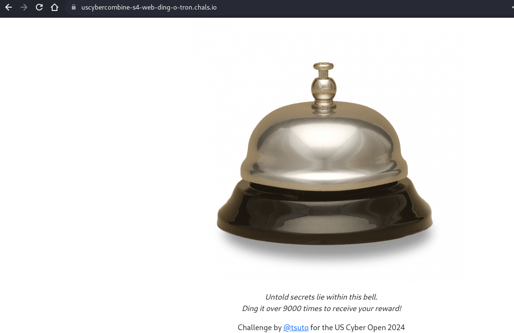
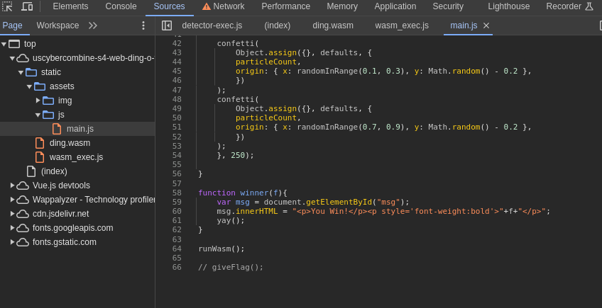
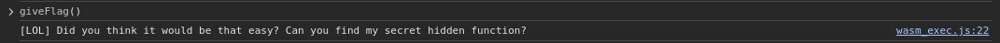
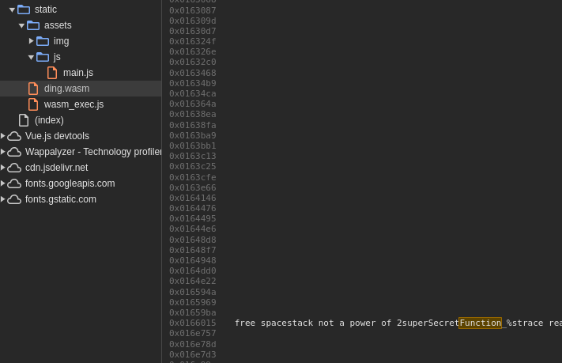
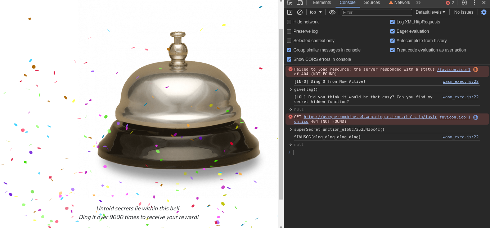

# Web: Ding-O-Tron (100)

What came first? The ding...or the flag?

[https://uscybercombine-s4-web-ding-o-tron.chals.io/](https://uscybercombine-s4-web-ding-o-tron.chals.io/)

Author: [tsuto](https://github.com/jselliott)

When we go to the website, we can see that we are apparently supposed to ding the bell 9000 times.

However, 9000 is a lot of times, so there has to be an easier way!

Looking through sources, we can find two things:

First, WebAssembly is apparently used on this webpage. And second, there is an interesting function, `giveFlag()` commented out in main.js that is not defined in any JavaScript files.

However, running this function tells us that it's not that easy...

But we can see that this function is defined in our WebAssembly! 

Just searching for "function" in our WASM file, we can find something interesting...

Using this and DevTools autocomplete, we can get the flag!

And our flag is `SIVUSCG{d1ng_d1ng_d1ng_d1ng}`!