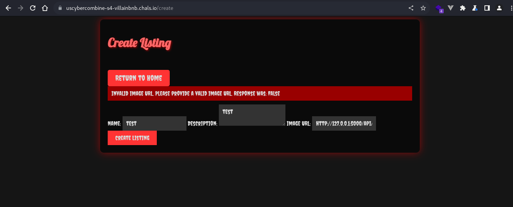
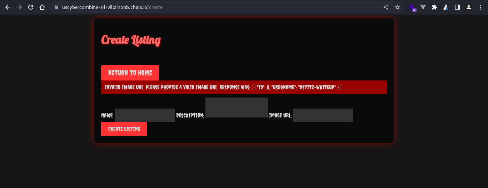
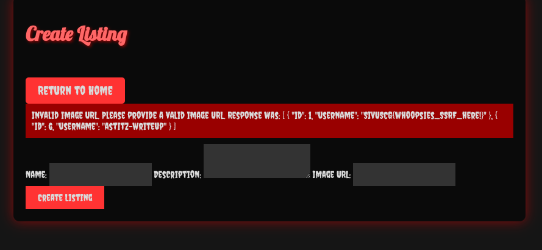

# Web: VillainBnB (419)

This is a website where Villains can get short-term rentals for their nerfarious deeds. There's a flag here somewhere though, can you get it from the database?

[https://uscybercombine-s4-villainbnb.chals.io/](https://uscybercombine-s4-villainbnb.chals.io/)

For this web challenge, we are given a zip file of the code. First, we need to extract it, and then everything we need is in app.py.

Here, we can see first that there is a wrapper for URLs that can only be accessed locally.

```py
def localhost_only(func):
    @wraps(func)
    def wrapper(*args, **kwargs):
        if request.remote_addr != '127.0.0.1':
            return jsonify({'error': 'Access denied'}), 403
        return func(*args, **kwargs)
    return wrapper
```

Also, the flag is added to a database just for the flag:

```py
    db.session.add(Flag(flag=FLAG))
```


We also see that SQLAlchemy is used, and the `/api/users` path has the following code:

```py
@api_bp.route('/users', methods=['GET'])
@localhost_only
def get_users():
    username = request.args.get('username')
    if username:
        query = f"SELECT * FROM user WHERE username ='{username}'"
        users = db.session.execute(text(query)).fetchall()
        users_data = [{'id': u.id, 'username': u.username} for u in users]
        return jsonify(users_data)
    else:
        users = User.query.all()
        users_data = [{'id': u.id, 'username': u.username} for u in users]
        return jsonify(users_data)
```

`db.session.execute` is certainly vulnerable to SQL injection, but this is a localhost-only path! 

So, we will need a way to bypass that.

In the `/create` path, which we can access when logged in, we see this:

```py
@app.route('/create', methods=['GET', 'POST'])
@login_required
def create_listing():
    if request.method == 'POST':
        name = request.form['name']
        description = request.form['description']
        image_url = request.form['image_url']

        valid_img = validate_image_url(image_url)

        if valid_img != True:
            flash(f'Invalid image URL. Please provide a valid image URL.\n\nResponse was:\n\n{valid_img}', 'danger')
            return redirect(url_for('create_listing'))

        new_listing = Listing(name=name, description=description, image_url=image_url, author=current_user)
        db.session.add(new_listing)
        db.session.commit()
        flash('Listing created successfully!', 'success')
        return redirect(url_for('index'))

    return render_template('create_listing.html')
```

This seems interesting... We can input a URL and it will return the response if not a valid image...

Now how does it validate the URL?

We also have this function:

```py
def validate_image_url(url):
    try:
        response = requests.get(url, timeout=5)
        response.raise_for_status()
        content_type = response.headers.get('Content-Type')
        if content_type and 'image' in content_type:
            return True
        else:
            return response.text
    except requests.exceptions.RequestException:
        return False
```

Since it gets the URL, what if we chain attacks? What if we request the localhost URL for the users API?


First, we need to register and log in...

If we create a listing with the URL of `http://127.0.0.1:5000/api/users?username=astitz-writeup`, we see this worked!




And since we know that the user table has 3 columns from our app.py file, which are id, username, and password, we can start to craft a payload to get the flag.

However, an interesting thing with this is that it uses named columns, so rather than just doing something like `' union select 1, flag, 1 from flag union select * where username = '`, we need to name the columns using "as".


And using the payload `http://127.0.0.1:5000/api/users?username=astitz-writeup' union select id, flag as username, flag as password from flag union select * from user where username = '`, we can get the flag!



And our flag is `SIVUSCG{whoopsies_SSRF_here!}`! And we just chained a SSRF (Server-Side Request Forgery) with SQL injection!